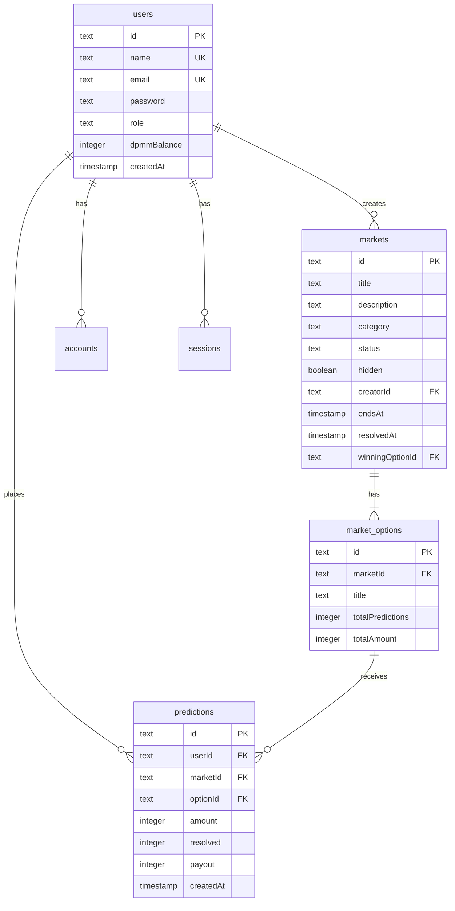

# 도파밈 (Dopameme) - 종합 프로젝트 문서

> 게임처럼 즐기는 예측 플랫폼
> 최종 업데이트: 2025-11-17

---

## 📚 목차

1. [프로젝트 개요](#1-프로젝트-개요)
2. [비즈니스 기획](#2-비즈니스-기획)
3. [기술 아키텍처](#3-기술-아키텍처)
4. [데이터베이스 설계](#4-데이터베이스-설계)
5. [핵심 기능 구현](#5-핵심-기능-구현)
6. [UI/UX 디자인 시스템](#6-uiux-디자인-시스템)
7. [인증 및 보안](#7-인증-및-보안)
8. [배포 및 운영](#8-배포-및-운영)
9. [개발 가이드](#9-개발-가이드)
10. [향후 로드맵](#10-향후-로드맵)

---

## 1. 프로젝트 개요

### 1.1 서비스 정의

**도파밈(Dopameme)**은 사용자들이 정치, 경제, 스포츠, 연예 등 실세계 이벤트의 결과를 예측하고, 게임용 포인트(DPMM)를 사용하여 참여하는 소셜 예측 게임 플랫폼입니다.

### 1.2 핵심 가치 제안

- **🎮 게이미피케이션**: 사행성을 배제한 순수 게임형 예측 플랫폼
- **🧠 집단 지성**: 사용자들의 예측 데이터를 통한 여론 분석
- **🎯 인포테인먼트**: 뉴스와 이슈를 능동적으로 소비하는 새로운 방식
- **💰 안전성**: 현금화 불가능한 포인트 시스템으로 법적 리스크 최소화

### 1.3 타겟 고객

#### Primary Target (핵심)
- **2030 MZ세대**
  - 정치, 사회, 경제 이슈에 관심 많음
  - 밈(Meme) 문화와 게이미피케이션에 익숙
  - 주식, 코인 등 투자에 관심이 있으나 가벼운 경험 선호

#### Secondary Target (확장)
- **이슈 매니아**: 특정 분야(스포츠, 정치, 연예)의 전문 지식을 증명하고 싶은 사용자
- **앱테크 유저**: 포인트 적립 및 활용에 익숙한 사용자

### 1.4 시장 규모 및 성장성

- **글로벌 예측 시장 규모**: $580B
- **연평균 성장률 (CAGR)**: 23.4%
- **AI 예측 정확도**: 87%
- **전세계 사용자**: 150M+

### 1.5 팀 구성

| 역할 | 이름 | 연락처 |
|------|------|--------|
| CEO | 레온 스카이 | - |
| CTO | 밈쭌 | - |
| CPO | 강블리 | - |
| CFO | 제트 | zett@dopameme.kr |

### 1.6 투자 현황

- **리드 투자사**: 프라이머 사제파트너스
- **참여사**: 스파크랩, 본엔젤스벤처파트너스
- **2024년 3월**: 30억원 시드 투자 유치

---

## 2. 비즈니스 기획

### 2.1 비전 및 목표

#### 비전
1. 대한민국 No.1 이슈 예측 '놀이터' 포지셔닝
2. 집단 지성 기반 여론 데이터 허브 구축
3. 사행성 배제한 안전한 게임 플랫폼 제공

#### 목표
사용자들이 뉴스와 이슈를 단순 소비하는 것을 넘어, '예측'이라는 게임을 통해 적극적으로 의견을 표현하고 즐기는 새로운 인포테인먼트 문화 선도

### 2.2 핵심 기능 (Core Features)

#### A. 포인트 시스템 ('도파밈' - DPMM)

**중요**: 현금화 및 외부 전송 불가능 → 사행성 이슈 원천 차단

##### 획득 방법
- 신규 회원가입 웰컴 보너스: **10,000 DPMM**
- 일일 출석체크 (로그인 보너스)
- 예측 게임 참여 보상
- 예측 성공 리워드
- 커뮤니티 활동 (게시글, 댓글)
- 친구 초대 (리퍼럴)

##### 사용 방법
- 예측 게임(마켓) 참여 시 지분 구매
- 프로필 꾸미기 아이템 (뱃지, 칭호)
- 특별 이벤트 마켓 참여권

#### B. 예측 게임 ('밈 마켓' - Meme Market)

##### 마켓 생성 정책
- **초기**: 운영자(Admin)가 직접 시의성 있고 흥미로운 주제로 마켓 생성
- **중기**: 우수 활동자에 한해 마켓 개설 권한 부여

##### 마켓 카테고리
- **정치/사회**: 지지율, 정책, 선거 등
- **경제/금융**: 주가, 환율, 금리 등
- **스포츠/E-sports**: 경기 결과, 우승팀, MVP 등
- **연예/문화**: 박스오피스, 시상식, 차트 등
- **과학기술**: 신제품 출시, 기술 발표 등
- **국제**: 국제 정세, 외교 이슈 등

##### 거래 방식
- **바이너리(Binary) 옵션**: 모든 예측은 'Yes' 또는 'No'로 귀결
- **동적 확률 시스템**:
  - 각 옵션의 확률은 베팅 금액에 비례하여 실시간 변동
  - 예: YES에 60% 베팅, NO에 40% 베팅 → YES 확률 60%, NO 확률 40%
  - 사용자는 현재 확률 기반으로 예측 의사결정

##### 결과 판정
- 이벤트 종료 및 결과 확정 시 관리자가 마켓 종료
- 승리한 옵션 선택자들에게 전체 베팅 풀 분배
- 1% 플랫폼 수수료 부과
- 수수료는 'fee-burn-account'로 집계

##### 보상 계산 공식
```
개인 보상 = (개인 베팅액 / 승리 옵션 총액) × 전체 베팅액 × 0.99
```

**예시**:
- 전체 베팅액: 1,000,000 DPMM
- YES 베팅액: 600,000 DPMM (60%)
- NO 베팅액: 400,000 DPMM (40%)
- 결과: YES 승리
- A 사용자가 YES에 60,000 DPMM 베팅
- A 사용자 보상: (60,000 / 600,000) × 1,000,000 × 0.99 = 99,000 DPMM
- A 사용자 순수익: 99,000 - 60,000 = 39,000 DPMM (65% 수익률)

#### C. 커뮤니티 및 랭킹

##### 순위표 (Leaderboard)
- 보유 포인트 랭킹
- 주간/월간 수익률 랭킹 (향후 구현)
- 예측 성공률 랭킹 (향후 구현)
- 상위 랭커에게 특별 뱃지/칭호 부여

##### 커뮤니티 (향후 구현)
- 마켓별 토론 게시판
- 사용자 간 정보 교환 및 의견 공유

### 2.3 차별화 전략

| 경쟁사 | 도파밈 |
|--------|--------|
| Polymarket, Kalshi: 실제 돈/암호화폐 거래 | **포인트 기반 게임**, 현금화 불가 |
| 금융/도박 성격 강함 | **순수 게임**으로 정의, 사행성 규제 회피 |
| 높은 진입 장벽, 금전적 리스크 | **무료 가입**, 금전적 손실 위험 없음 |
| 전문가 중심 | **밈 문화 + 트렌드** 중심, 대중 친화적 |

### 2.4 비즈니스 모델 (수익화)

#### 1. 광고 (Advertising)
- **배너 광고**: 디스플레이 광고(DA) 게재
- **스폰서 마켓**: 기업/브랜드 협찬 예측 마켓
  - 예: "A사 신제품 첫 주 판매량 10만 대 돌파?"
  - 네이티브 광고 효과

#### 2. B2B 데이터 판매
- 비식별화된 예측 데이터 집계
- 여론 분석 리포트 판매
- 타겟: 기업, 정당, 리서치 기관
- 예: "신규 정책에 대한 20대 남성 여론 추이"

#### 3. 아이템 판매 (향후)
- 프로필 뱃지, 테마 스킨
- 랭킹 부스터
- 과시형/수집형 아이템

---

## 3. 기술 아키텍처

### 3.1 기술 스택

#### Frontend & Backend
```
Framework: Next.js 15 (App Router)
Language: TypeScript 5
Styling: Tailwind CSS 3.4
Runtime: Node.js 20+
```

#### Authentication
```
NextAuth.js v5.0.0-beta.30
- Session-based JWT 인증
- Credentials Provider (이메일/비밀번호)
- Google OAuth Provider
- bcryptjs: 비밀번호 해싱
```

#### Database
```
PostgreSQL (Supabase)
- Drizzle ORM 0.44.7: 타입 안전 쿼리
- Drizzle Kit 0.31.6: 마이그레이션
- postgres 3.4.7: 드라이버
```

#### Deployment
```
Hosting: Vercel
Domain: dopameme.kr
CI/CD: GitHub Actions (자동)
```

### 3.2 프로젝트 구조

```
dopameme.kr/
├── app/                              # Next.js App Router
│   ├── about/                        # 소개 페이지
│   ├── admin/                        # 관리자 기능
│   │   └── markets/
│   │       ├── create/               # 마켓 생성
│   │       └── [id]/
│   │           ├── resolve/          # 결과 확정
│   │           ├── toggle-hidden/    # 가리기/보이기
│   │           └── delete/           # 삭제
│   ├── api/
│   │   └── auth/[...nextauth]/       # NextAuth API 라우트
│   ├── app/                          # 내 활동 페이지
│   ├── leaderboard/                  # 순위표
│   ├── login/                        # 로그인
│   ├── markets/                      # 예측 시장 목록
│   │   └── [id]/                     # 예측 상세
│   ├── privacy/                      # 개인정보처리방침
│   ├── signup/                       # 회원가입
│   ├── terms/                        # 이용약관
│   ├── globals.css                   # 전역 스타일
│   ├── icon.svg                      # 파비콘
│   ├── layout.tsx                    # 루트 레이아웃
│   ├── opengraph-image.tsx           # OG 이미지
│   └── page.tsx                      # 랜딩 페이지
│
├── components/                       # 재사용 가능 컴포넌트
│   ├── Header.tsx                    # 헤더 (로고, 네비게이션, DPMM 잔액)
│   └── LogoutButton.tsx              # 로그아웃 버튼
│
├── lib/                              # 유틸리티 라이브러리
│   ├── db/
│   │   ├── index.ts                  # DB 연결
│   │   └── schema.ts                 # Drizzle 스키마
│   ├── auth-utils.ts                 # 인증 유틸리티
│   └── nickname-generator.ts         # 닉네임 생성기
│
├── scripts/                          # DB 스크립트
│   ├── create-fee-account.sql        # 수수료 계정 생성
│   ├── final-setup.sql               # 최종 설정
│   ├── generate-test-accounts.ts     # 테스트 계정 생성
│   └── ...
│
├── drizzle/                          # DB 마이그레이션
│   ├── meta/                         # 스냅샷
│   └── *.sql                         # SQL 마이그레이션
│
├── auth.ts                           # NextAuth 설정
├── middleware.ts                     # 라우트 보호 (제거됨)
├── tailwind.config.ts                # Tailwind 설정
├── tsconfig.json                     # TypeScript 설정
├── drizzle.config.ts                 # Drizzle 설정
├── package.json                      # 의존성
├── .env.local                        # 환경 변수 (gitignore)
├── README.md                         # 프로젝트 소개
├── dopameme_plan.md                  # 기획서
├── dopameme_dev.md                   # 개발 계획서
└── DOCUMENTATION.md                  # 본 문서
```

### 3.3 라우팅 구조

#### 공개 페이지 (Public Routes)
- `/` - 랜딩 페이지
- `/about` - 서비스 소개
- `/terms` - 이용약관
- `/privacy` - 개인정보처리방침
- `/login` - 로그인
- `/signup` - 회원가입

#### 인증 필요 페이지 (Protected Routes)
- `/app` - 내 활동 (내 예측, 포인트 내역, 통계)
- `/markets` - 예측 시장 목록
- `/markets/[id]` - 예측 상세 및 마켓 토론
- `/leaderboard` - 순위표

#### 관리자 전용 페이지 (Admin Only)
- `/admin/markets/create` - 마켓 생성
- `/admin/markets/[id]/resolve` - 결과 확정
- `/admin/markets/[id]/toggle-hidden` - 가리기/보이기
- `/admin/markets/[id]/delete` - 삭제

### 3.4 Server Actions 아키텍처

Next.js 15의 Server Actions를 활용한 API-less 아키텍처:

```typescript
// app/markets/[id]/actions.ts
'use server'

export async function placePrediction(formData) {
  // 1. 인증 확인
  const session = await auth()

  // 2. 데이터 검증
  // 3. 트랜잭션 처리
  await db.transaction(async (tx) => {
    // - 예측 생성
    // - 잔액 차감
    // - 통계 업데이트
  })

  // 4. 캐시 재검증
  revalidatePath('/markets')

  return { success: true }
}
```

**장점**:
- API 라우트 불필요
- 타입 안전성 보장
- 자동 에러 처리
- 코드 분할 최적화

---

## 4. 데이터베이스 설계

### 4.1 ERD (Entity Relationship Diagram)

```
┌──────────────┐         ┌──────────────────┐         ┌──────────────────┐
│    users     │────1:N──│   predictions    │──N:1────│ market_options   │
└──────────────┘         └──────────────────┘         └──────────────────┘
       │                                                        │
       │                                                        │
       │                  ┌──────────────────┐                 │
       └──────────────────│     markets      │─────────────────┘
                          └──────────────────┘
                                   │
                                   │
                          ┌──────────────────┐
                          │    accounts      │
                          └──────────────────┘
                          ┌──────────────────┐
                          │    sessions      │
                          └──────────────────┘
```

### 4.2 테이블 스키마

#### users (사용자)

| 컬럼명 | 타입 | 제약조건 | 설명 |
|--------|------|----------|------|
| id | text | PRIMARY KEY | UUID |
| name | text | UNIQUE | 닉네임 (영문+특수문자 12자) |
| email | text | UNIQUE | 이메일 |
| emailVerified | timestamp | - | 이메일 인증 시간 |
| image | text | - | 프로필 이미지 URL |
| password | text | - | 해시화된 비밀번호 (Credentials 로그인용) |
| role | text | DEFAULT 'user' | 역할 (user, admin, test) |
| dpmmBalance | integer | DEFAULT 10000 | DPMM 잔액 (웰컴 보너스) |
| createdAt | timestamp | DEFAULT NOW() | 가입 일시 |

**인덱스**:
- PRIMARY KEY: `id`
- UNIQUE: `email`, `name`

#### accounts (OAuth 계정)

NextAuth.js Drizzle Adapter 표준 스키마

| 컬럼명 | 타입 | 제약조건 | 설명 |
|--------|------|----------|------|
| userId | text | FK → users.id | 사용자 ID |
| type | text | NOT NULL | 계정 타입 |
| provider | text | NOT NULL | OAuth 제공자 (google) |
| providerAccountId | text | NOT NULL | 제공자 계정 ID |
| refresh_token | text | - | 리프레시 토큰 |
| access_token | text | - | 액세스 토큰 |
| expires_at | integer | - | 만료 시간 |
| token_type | text | - | 토큰 타입 |
| scope | text | - | 스코프 |
| id_token | text | - | ID 토큰 |
| session_state | text | - | 세션 상태 |

**인덱스**:
- COMPOSITE PRIMARY KEY: `(provider, providerAccountId)`

#### sessions (세션)

NextAuth.js 세션 관리 (현재 JWT 전략 사용으로 미사용)

| 컬럼명 | 타입 | 제약조건 | 설명 |
|--------|------|----------|------|
| sessionToken | text | PRIMARY KEY | 세션 토큰 |
| userId | text | FK → users.id | 사용자 ID |
| expires | timestamp | NOT NULL | 만료 시간 |

#### markets (예측 마켓)

| 컬럼명 | 타입 | 제약조건 | 설명 |
|--------|------|----------|------|
| id | text | PRIMARY KEY | UUID |
| title | text | NOT NULL | 마켓 제목 |
| description | text | NOT NULL | 상세 설명 |
| category | text | NOT NULL | 카테고리 (정치, 경제, 스포츠 등) |
| imageUrl | text | - | 대표 이미지 URL |
| status | text | DEFAULT 'active' | 상태 (active, closed, resolved) |
| hidden | boolean | DEFAULT false | 관리자 숨김 여부 |
| creatorId | text | FK → users.id | 생성자 ID |
| createdAt | timestamp | DEFAULT NOW() | 생성 일시 |
| endsAt | timestamp | NOT NULL | 마감 일시 |
| resolvedAt | timestamp | - | 결과 확정 일시 |
| winningOptionId | text | - | 승리 옵션 ID |

**인덱스**:
- PRIMARY KEY: `id`
- INDEX: `status`, `category`, `createdAt`

#### market_options (마켓 옵션)

| 컬럼명 | 타입 | 제약조건 | 설명 |
|--------|------|----------|------|
| id | text | PRIMARY KEY | UUID |
| marketId | text | FK → markets.id | 마켓 ID |
| title | text | NOT NULL | 옵션 제목 (YES/NO 등) |
| totalPredictions | integer | DEFAULT 0 | 총 예측 수 |
| totalAmount | integer | DEFAULT 0 | 총 베팅 금액 (DPMM) |
| createdAt | timestamp | DEFAULT NOW() | 생성 일시 |

**인덱스**:
- PRIMARY KEY: `id`
- INDEX: `marketId`

#### predictions (사용자 예측)

| 컬럼명 | 타입 | 제약조건 | 설명 |
|--------|------|----------|------|
| id | text | PRIMARY KEY | UUID |
| userId | text | FK → users.id | 사용자 ID |
| marketId | text | FK → markets.id | 마켓 ID |
| optionId | text | FK → market_options.id | 선택 옵션 ID |
| amount | integer | NOT NULL | 베팅 금액 (DPMM) |
| createdAt | timestamp | DEFAULT NOW() | 예측 일시 |
| resolved | integer | DEFAULT 0 | 결과 (0: 대기, 1: 승리, -1: 패배) |
| payout | integer | DEFAULT 0 | 지급액 (DPMM) |

**인덱스**:
- PRIMARY KEY: `id`
- INDEX: `userId`, `marketId`, `optionId`
- COMPOSITE INDEX: `(userId, marketId)` - 중복 베팅 방지

### 4.3 주요 쿼리 패턴

#### 예측 참여 (트랜잭션)

```typescript
await db.transaction(async (tx) => {
  // 1. 예측 레코드 생성
  await tx.insert(predictions).values({
    userId, marketId, optionId, amount
  })

  // 2. 사용자 잔액 차감
  await tx.update(users)
    .set({ dpmmBalance: sql`${users.dpmmBalance} - ${amount}` })
    .where(eq(users.id, userId))

  // 3. 옵션 통계 업데이트
  await tx.update(marketOptions)
    .set({
      totalPredictions: sql`${marketOptions.totalPredictions} + 1`,
      totalAmount: sql`${marketOptions.totalAmount} + ${amount}`
    })
    .where(eq(marketOptions.id, optionId))
})
```

#### 마켓 결과 확정 (트랜잭션)

```typescript
await db.transaction(async (tx) => {
  // 1. 마켓 상태 업데이트
  await tx.update(markets).set({
    status: 'resolved',
    resolvedAt: new Date(),
    winningOptionId
  }).where(eq(markets.id, marketId))

  // 2. 승리자들에게 보상 지급 (1% 수수료 공제)
  for (const prediction of winnerPredictions) {
    const grossPayout = (prediction.amount / winningTotal) * totalBet
    const fee = Math.floor(grossPayout * 0.01)
    const netPayout = grossPayout - fee

    await tx.update(predictions).set({
      resolved: 1,
      payout: netPayout
    }).where(eq(predictions.id, prediction.id))

    await tx.update(users).set({
      dpmmBalance: sql`${users.dpmmBalance} + ${netPayout}`
    }).where(eq(users.id, prediction.userId))
  }

  // 3. 수수료 소각 계정에 입금
  await tx.update(users).set({
    dpmmBalance: sql`${users.dpmmBalance} + ${totalFees}`
  }).where(eq(users.id, 'fee-burn-account'))

  // 4. 패배자 예측 업데이트
  await tx.update(predictions).set({
    resolved: -1,
    payout: 0
  }).where(sql`...`)
})
```

---

## 5. 핵심 기능 구현

### 5.1 인증 시스템

#### 5.1.1 NextAuth.js 설정 (`auth.ts`)

```typescript
export const { handlers, signIn, signOut, auth } = NextAuth({
  adapter: DrizzleAdapter(db),
  session: { strategy: 'jwt' },
  providers: [
    Google({
      clientId: process.env.GOOGLE_CLIENT_ID,
      clientSecret: process.env.GOOGLE_CLIENT_SECRET,
    }),
    Credentials({
      async authorize(credentials) {
        const user = await db.select()
          .from(users)
          .where(eq(users.email, credentials.email))

        if (!user[0].password) {
          throw new Error('다른 로그인 방법을 사용해주세요')
        }

        const isValid = await bcrypt.compare(
          credentials.password,
          user[0].password
        )

        if (!isValid) throw new Error('비밀번호 오류')

        return user[0]
      }
    })
  ],
  callbacks: {
    jwt({ token, user }) {
      if (user) token.id = user.id
      return token
    },
    session({ session, token }) {
      session.user.id = token.id
      return session
    }
  }
})
```

#### 5.1.2 회원가입 Flow

1. **프론트엔드** (`app/signup/page.tsx`):
   - 이메일, 비밀번호, 비밀번호 확인 입력
   - 클라이언트 유효성 검증

2. **서버 액션** (`app/signup/actions.ts`):
   ```typescript
   export async function signUpAction(formData) {
     // 1. 이메일 중복 확인
     // 2. 비밀번호 해싱 (bcrypt)
     // 3. 랜덤 닉네임 생성
     // 4. 사용자 생성 (웰컴 보너스 10,000 DPMM)
     // 5. 자동 로그인 (signIn)
   }
   ```

3. **닉네임 생성** (`lib/nickname-generator.ts`):
   - 형용사 + 명사 조합 (예: "HappyPanda")
   - 중복 방지 로직

#### 5.1.3 로그인 Flow

**Credentials 로그인**:
```typescript
await signIn('credentials', {
  email,
  password,
  redirectTo: '/app'
})
```

**Google OAuth**:
```typescript
await signIn('google', {
  redirectTo: '/app'
})
```

#### 5.1.4 권한 검증

**관리자 권한 확인** (`lib/auth-utils.ts`):
```typescript
export async function requireAdmin() {
  const session = await auth()

  const [user] = await db.select()
    .from(users)
    .where(eq(users.id, session.user.id))

  if (user.role !== 'admin') {
    throw new Error('관리자 권한이 필요합니다')
  }

  return user
}
```

### 5.2 예측 시스템

#### 5.2.1 마켓 목록 조회

**파일**: `app/markets/page.tsx`

```typescript
// 카테고리별 필터링
const filteredMarkets = await db.select()
  .from(markets)
  .leftJoin(marketOptions, eq(markets.id, marketOptions.marketId))
  .leftJoin(users, eq(markets.creatorId, users.id))
  .where(
    and(
      eq(markets.status, 'active'),
      eq(markets.hidden, false),
      category ? eq(markets.category, category) : undefined
    )
  )
  .orderBy(desc(markets.createdAt))
```

**기능**:
- 카테고리 필터링 (전체, 정치, 경제, 스포츠 등)
- Active 마켓만 표시
- Hidden 마켓 제외 (관리자는 볼 수 있음)
- 최신순 정렬

#### 5.2.2 마켓 상세 페이지

**파일**: `app/markets/[id]/page.tsx`

**표시 정보**:
- 마켓 제목, 설명, 카테고리
- 마감 시간 (Countdown)
- 각 옵션의 현재 확률
- 총 베팅액, 참여자 수
- 사용자의 예측 참여 폼

**확률 계산**:
```typescript
const yesTotal = yesOption.totalAmount
const noTotal = noOption.totalAmount
const total = yesTotal + noTotal

const yesPercent = total > 0 ? (yesTotal / total) * 100 : 50
const noPercent = total > 0 ? (noTotal / total) * 100 : 50
```

#### 5.2.3 예측 참여

**파일**: `app/markets/[id]/actions.ts`

**검증 로직**:
1. ✅ 로그인 확인
2. ✅ 베팅 금액 범위 (100 ~ 10,000 DPMM)
3. ✅ 사용자 잔액 확인
4. ✅ 마켓 상태 확인 (active)
5. ✅ 마감 시간 확인
6. ✅ 중복 베팅 방지 (한 마켓당 1회만)

**트랜잭션 처리**:
- 예측 레코드 생성
- 사용자 잔액 차감
- 옵션 통계 업데이트 (totalPredictions, totalAmount)
- 캐시 재검증 (`revalidatePath`)

**제약사항**:
- 한 마켓당 하나의 포지션만 가능
- 베팅 후 취소/변경 불가 (MVP)

#### 5.2.4 마켓 토론 댓글

**파일**: `app/markets/[id]/actions.ts`

**Flow**:
1. 로그인 및 활성 계정 확인
2. 댓글 길이 검증 (2~500자)
3. 사용자/마켓/IP 단위 rate limit 적용
4. 숨김 마켓은 관리자만 댓글 작성 가능
5. `market_comments`에 visible 댓글 저장 후 마켓 상세 재검증

**표시 정책**:
- 마켓 상세에서 visible 댓글 최신 30개 표시
- 댓글 본문은 React 렌더링 escape와 `whitespace-pre-wrap`으로 표시
- 삭제/블라인드 등 고급 moderation은 이후 관리자 기능에서 확장

#### 5.2.5 결과 확정 (Admin)

**파일**: `app/admin/markets/[id]/resolve/actions.ts`

**Flow**:
1. 관리자 권한 확인 (`requireAdmin()`)
2. 마켓 상태 확인 (이미 확정되지 않았는지)
3. 승리 옵션 유효성 검증
4. 트랜잭션 처리:
   - 마켓 상태 → 'resolved'
   - 승리자들에게 보상 계산 및 지급 (1% 수수료 공제)
   - 수수료 → fee-burn-account
   - 패배자 예측 → resolved: -1

**보상 분배 알고리즘**:
```typescript
const totalBetAmount = allOptions.reduce((sum, opt) => sum + opt.totalAmount, 0)
const winningTotalAmount = winningOption.totalAmount

for (const prediction of winnerPredictions) {
  const grossPayout = Math.floor(
    (prediction.amount / winningTotalAmount) * totalBetAmount
  )
  const fee = Math.floor(grossPayout * 0.01)
  const netPayout = grossPayout - fee

  // 사용자에게 netPayout 지급
}
```

### 5.3 관리자 기능

#### 5.3.1 마켓 생성

**파일**: `app/admin/markets/create/page.tsx`

**필수 입력**:
- 제목 (title)
- 설명 (description)
- 카테고리 (category)
- 마감 일시 (endsAt)
- 옵션 2개 (기본: YES, NO)

**자동 설정**:
- creatorId: 현재 로그인한 관리자
- status: 'active'
- hidden: false

#### 5.3.2 마켓 가리기/보이기

**파일**: `app/admin/markets/[id]/toggle-hidden/actions.ts`

**기능**:
- 문제가 있는 마켓을 일반 사용자에게 숨김
- 관리자는 계속 볼 수 있음
- 삭제 전 안전장치 (가려진 마켓만 삭제 가능)

**UI**:
- 마켓 상세 페이지에 "가리기/보이기" 버튼 (관리자만 표시)
- 가려진 마켓은 배경색 변경 (노란색)

#### 5.3.3 마켓 삭제

**파일**: `app/admin/markets/[id]/delete/actions.ts`

**안전장치**:
- **가려진(hidden: true) 마켓만 삭제 가능**
- 실수로 삭제 방지

**Cascade 삭제**:
- market_options 자동 삭제
- predictions 자동 삭제 (FK ON DELETE CASCADE)

### 5.4 내 활동 페이지

**파일**: `app/app/page.tsx`

**섹션**:

1. **내 통계**
   - 현재 DPMM 잔액
   - 총 예측 수
   - 진행 중 예측 수
   - 확정된 예측 수

2. **내 예측 목록**
   - 진행 중 / 확정됨 탭
   - 각 예측:
     - 마켓 제목
     - 선택한 옵션
     - 베팅 금액
     - 현재 상태 (진행 중 / 승리 / 패배)
     - 지급액 (확정된 경우)

3. **포인트 내역** (향후 구현)
   - 획득/사용 내역
   - 일시, 금액, 사유

### 5.5 순위표

**파일**: `app/leaderboard/page.tsx`

**랭킹**:
- 전체 사용자 DPMM 잔액 기준
- 상위 100명 표시
- 현재 사용자 순위 하이라이트

**표시 정보**:
- 순위
- 닉네임
- DPMM 잔액
- 역할 배지 (관리자: 🔑, 테스트: 🧪)

---

## 6. UI/UX 디자인 시스템

### 6.1 컬러 팔레트

```css
/* Primary Colors */
--primary-blue: #2563EB;      /* 주요 파랑 (링크, 버튼) */
--primary-red: #DC2626;       /* 주요 빨강 (액센트, 경고) */

/* Secondary Colors */
--success-green: #10B981;     /* 성공, 긍정 */
--warning-yellow: #F59E0B;    /* 경고 */
--info-cyan: #06B6D4;         /* 정보 */
--accent-purple: #8B5CF6;     /* 강조 */
--accent-gold: #F59E0B;       /* 골드 (프리미엄) */

/* Neutral Colors */
--gray-50: #F9FAFB;
--gray-100: #F3F4F6;
--gray-200: #E5E7EB;
--gray-300: #D1D5DB;
--gray-500: #6B7280;
--gray-700: #374151;
--gray-900: #111827;

/* Background */
--bg-primary: #FFFFFF;
--bg-secondary: #F9FAFB;
```

### 6.2 타이포그래피

```css
/* Font Family */
font-family: -apple-system, BlinkMacSystemFont, 'Segoe UI', 'Roboto', 'Oxygen', 'Ubuntu', 'Cantarell', 'Fira Sans', 'Droid Sans', 'Helvetica Neue', sans-serif;

/* Font Sizes */
--text-xs: 0.75rem;      /* 12px */
--text-sm: 0.875rem;     /* 14px */
--text-base: 1rem;       /* 16px */
--text-lg: 1.125rem;     /* 18px */
--text-xl: 1.25rem;      /* 20px */
--text-2xl: 1.5rem;      /* 24px */
--text-3xl: 1.875rem;    /* 30px */
--text-4xl: 2.25rem;     /* 36px */
```

### 6.3 컴포넌트 스타일 가이드

#### 버튼

```tsx
// Primary Button (파랑)
<button className="bg-blue-600 text-white px-4 py-2 rounded-lg hover:bg-blue-700">
  예측 참여하기
</button>

// Secondary Button (빨강)
<button className="bg-red-600 text-white px-4 py-2 rounded-lg hover:bg-red-700">
  삭제
</button>

// Outline Button
<button className="border border-blue-600 text-blue-600 px-4 py-2 rounded-lg hover:bg-blue-50">
  로그인
</button>
```

#### 카드

```tsx
<div className="bg-white border border-gray-200 rounded-xl p-6 shadow-sm hover:shadow-md transition">
  {/* 카드 내용 */}
</div>
```

#### 배지

```tsx
// 카테고리 배지
<span className="inline-flex items-center px-3 py-1 rounded-full text-xs font-medium bg-blue-100 text-blue-800">
  정치
</span>

// 상태 배지
<span className="inline-flex items-center px-3 py-1 rounded-full text-xs font-medium bg-green-100 text-green-800">
  진행 중
</span>
```

### 6.4 로고 디자인

**도파밈 로고 컬러링**:
- **도** - 파랑 (`#2563EB`)
- **파** - 빨강 (`#DC2626`)
- **밈** - 파랑 (`#2563EB`)

```tsx
<h1 className="text-2xl font-bold">
  <span className="text-blue-600">도</span>
  <span className="text-red-600">파</span>
  <span className="text-blue-600">밈</span>
</h1>
```

### 6.5 헤더 (Header)

**파일**: `components/Header.tsx`

**구조**:
```
┌─────────────────────────────────────────────────────┐
│ 도파밈 로고    [메뉴]    [DPMM 잔액] [내 활동] [로그아웃] │
└─────────────────────────────────────────────────────┘
```

**로그인 전**:
- 도파밈 로고
- [로그인] [회원가입] 버튼

**로그인 후**:
- 도파밈 로고
- 예측 시장, 순위표 링크
- DPMM 잔액 표시 (동적)
- 내 활동 버튼
- 로그아웃 버튼

**스타일**:
- Sticky 헤더 (`sticky top-0 z-50`)
- 그림자 효과 (`shadow-md`)
- 배경색: 흰색

### 6.6 푸터 (Footer)

**구조**:
```
┌───────────────────────────────────────────────────────┐
│  [로고 + 설명]  │  [서비스 메뉴]  │  [정보 메뉴]  │
├───────────────────────────────────────────────────────┤
│  © 2025 도파밈. All rights reserved.                 │
└───────────────────────────────────────────────────────┘
```

**메뉴**:
- 서비스: 예측 시장, 순위표, 내 활동
- 정보: 도파밈 소개, 이용약관, 개인정보처리방침

### 6.7 반응형 디자인

**Breakpoints** (Tailwind):
```
sm: 640px   (모바일)
md: 768px   (태블릿)
lg: 1024px  (데스크톱)
xl: 1280px  (큰 화면)
```

**모바일 최적화**:
- 헤더: 햄버거 메뉴 (향후 구현)
- 카드: 1열 배치
- 폰트 크기 조정

---

## 7. 인증 및 보안

### 7.1 비밀번호 보안

**해싱 알고리즘**: bcryptjs (Salt rounds: 10)

```typescript
import bcrypt from 'bcryptjs'

// 회원가입 시
const hashedPassword = await bcrypt.hash(password, 10)

// 로그인 시
const isValid = await bcrypt.compare(inputPassword, hashedPassword)
```

### 7.2 세션 관리

**전략**: JWT (JSON Web Token)

```typescript
// auth.ts
session: { strategy: 'jwt' }

callbacks: {
  jwt({ token, user }) {
    if (user) token.id = user.id
    return token
  },
  session({ session, token }) {
    session.user.id = token.id
    return session
  }
}
```

**JWT 내용**:
- `id`: 사용자 ID
- `email`: 이메일
- `name`: 닉네임
- `exp`: 만료 시간

### 7.3 환경 변수 보안

**파일**: `.env.local` (gitignore)

```env
# Database
DATABASE_URL=postgresql://...

# NextAuth
AUTH_SECRET=your-auth-secret-key
AUTH_GOOGLE_ID=your-google-oauth-client-id
AUTH_GOOGLE_SECRET=your-google-oauth-client-secret
NEXTAUTH_URL=http://localhost:3000
```

**주의사항**:
- `.env.local` 파일 절대 커밋 금지
- Vercel 환경 변수 설정에서 프로덕션 값 입력

### 7.4 SQL Injection 방지

**Drizzle ORM Parameterized Queries**:

```typescript
// ✅ 안전
const user = await db.select()
  .from(users)
  .where(eq(users.email, userInput))

// ❌ 위험 (사용 금지)
await db.execute(sql`SELECT * FROM users WHERE email = '${userInput}'`)
```

### 7.5 XSS 방지

**React 자동 이스케이핑**:
- React는 기본적으로 모든 텍스트를 이스케이핑
- `dangerouslySetInnerHTML` 사용 금지

### 7.6 CSRF 방지

**NextAuth.js 내장 CSRF 보호**:
- 모든 POST 요청에 CSRF 토큰 자동 포함
- 서버에서 토큰 검증

### 7.7 Rate Limiting (향후 구현)

- 로그인 시도: 5회/분
- 예측 참여: 10회/분
- API 요청: 100회/분

**구현 방안**:
- Vercel Edge Middleware
- Upstash Rate Limiting

---

## 8. 배포 및 운영

### 8.1 호스팅 환경

**플랫폼**: Vercel

**배포 방식**:
- GitHub 연동 자동 배포
- main 브랜치 → 프로덕션
- Pull Request → 미리보기 환경

**도메인**:
- 프로덕션: `dopameme.kr`
- 미리보기: `dopameme-kr-<branch>.vercel.app`

### 8.2 데이터베이스

**플랫폼**: Supabase (PostgreSQL)

**백업**:
- 자동 백업: 매일 1회
- 보관 기간: 7일
- Point-in-time Recovery (PITR): 지원

### 8.3 CI/CD 파이프라인

**GitHub Actions** (향후 구현):

```yaml
# .github/workflows/ci.yml
name: CI
on: [push, pull_request]
jobs:
  test:
    runs-on: ubuntu-latest
    steps:
      - uses: actions/checkout@v3
      - uses: actions/setup-node@v3
      - run: npm ci
      - run: npm run lint
      - run: npm run build
```

### 8.4 모니터링

**Vercel Analytics**:
- 페이지 뷰
- 방문자 수
- 성능 지표 (Core Web Vitals)

**Sentry** (향후 구현):
- 에러 추적
- 성능 모니터링
- 사용자 피드백

### 8.5 로그 관리

**서버 로그**:
```typescript
console.log('[INFO] User signed up:', userId)
console.error('[ERROR] Prediction failed:', error)
```

**Vercel Logs**:
- 실시간 로그 스트리밍
- 검색 및 필터링
- 보관 기간: 7일 (Free), 30일 (Pro)

### 8.6 성능 최적화

#### 이미지 최적화
```tsx
import Image from 'next/image'

<Image
  src="/market-image.jpg"
  alt="마켓 이미지"
  width={800}
  height={400}
  priority={false}
  loading="lazy"
/>
```

#### 코드 분할
- Next.js 자동 코드 분할
- Dynamic Import:
  ```tsx
  const Chart = dynamic(() => import('@/components/Chart'), {
    ssr: false,
    loading: () => <Spinner />
  })
  ```

#### 캐싱 전략
```typescript
// 정적 페이지 (랜딩)
export const revalidate = false

// 동적 페이지 (마켓 목록)
export const revalidate = 60 // 60초마다 재검증

// Server Actions
revalidatePath('/markets')
```

---

## 9. 개발 가이드

### 9.1 로컬 개발 환경 설정

#### 1. 저장소 클론
```bash
git clone https://github.com/zeztto/dopameme.kr.git
cd dopameme.kr
```

#### 2. 의존성 설치
```bash
npm install
```

#### 3. 환경 변수 설정
`.env.local` 파일 생성:
```env
DATABASE_URL=postgresql://...
AUTH_SECRET=your-secret-key
AUTH_GOOGLE_ID=your-google-id
AUTH_GOOGLE_SECRET=your-google-secret
NEXTAUTH_URL=http://localhost:3000
```

#### 4. 데이터베이스 마이그레이션
```bash
npm run drizzle:push
```

#### 5. 개발 서버 실행
```bash
npm run dev
```

브라우저에서 `http://localhost:3000` 접속

### 9.2 개발 워크플로우

#### 브랜치 전략
```
main (프로덕션)
  └── develop (개발)
       ├── feature/user-authentication
       ├── feature/market-creation
       └── bugfix/prediction-error
```

#### 커밋 메시지 컨벤션
```
feat: 새로운 기능 추가
fix: 버그 수정
refactor: 리팩토링
docs: 문서 수정
style: 코드 포맷팅
test: 테스트 추가
chore: 빌드 설정 등
```

**예시**:
```
feat: Add Google OAuth login
fix: Fix prediction amount validation
refactor: Extract auth utility functions
```

### 9.3 코드 스타일 가이드

#### TypeScript
```typescript
// ✅ 명시적 타입 선언
interface User {
  id: string
  email: string
  name: string
}

// ✅ async/await 사용
async function fetchUser(id: string): Promise<User> {
  const user = await db.select()...
  return user
}

// ❌ any 타입 사용 지양
const data: any = ... // Bad
```

#### React
```tsx
// ✅ 함수형 컴포넌트
export default function MarketCard({ market }: Props) {
  return <div>...</div>
}

// ✅ Server Component 기본 사용
// 클라이언트 상태 필요한 경우만 'use client'

// ❌ 클래스 컴포넌트 사용 금지
```

#### Tailwind CSS
```tsx
// ✅ 간결한 클래스명
<div className="bg-white p-6 rounded-lg shadow-md">

// ❌ 인라인 스타일 사용 지양
<div style={{ backgroundColor: 'white', padding: '24px' }}>
```

### 9.4 테스트 (향후 구현)

#### 단위 테스트 (Jest)
```typescript
describe('placePrediction', () => {
  it('should create prediction and deduct balance', async () => {
    const result = await placePrediction({
      marketId: 'test-market',
      optionId: 'yes',
      amount: 1000
    })

    expect(result.success).toBe(true)
  })
})
```

#### E2E 테스트 (Playwright)
```typescript
test('user can place prediction', async ({ page }) => {
  await page.goto('/markets/test-market')
  await page.fill('[name="amount"]', '1000')
  await page.click('button:has-text("예측 참여하기")')
  await expect(page).toHaveURL('/app')
})
```

### 9.5 데이터베이스 마이그레이션

#### 스키마 변경
```bash
# 1. lib/db/schema.ts 수정

# 2. 마이그레이션 생성
npm run drizzle:generate

# 3. 마이그레이션 적용
npm run drizzle:push
```

#### 롤백 (수동)
```sql
-- drizzle/meta/_journal.json에서 마이그레이션 번호 확인
-- 해당 SQL 파일의 역순 작업 수행
```

### 9.6 디버깅

#### 서버 로그
```typescript
console.log('[DEBUG] Market data:', market)
console.error('[ERROR] Failed to create prediction:', error)
```

#### Drizzle 쿼리 로그
```typescript
// lib/db/index.ts
import { drizzle } from 'drizzle-orm/postgres-js'

export const db = drizzle(client, {
  logger: process.env.NODE_ENV === 'development'
})
```

#### React DevTools
- Components 탭: 컴포넌트 트리 확인
- Profiler 탭: 렌더링 성능 분석

---

## 10. 향후 로드맵

### Phase 1: MVP (완료)
- ✅ 사용자 인증 (이메일/비밀번호, Google OAuth)
- ✅ 포인트 시스템 (DPMM)
- ✅ 예측 마켓 생성 (관리자)
- ✅ 예측 참여 (YES/NO)
- ✅ 결과 확정 및 보상 분배
- ✅ 내 활동 페이지
- ✅ 순위표
- ✅ 관리자 기능 (가리기, 삭제)

### Phase 2: 커뮤니티 (Q1 2025)
- [x] 마켓별 댓글 시스템
- [ ] 사용자 프로필 페이지
- [ ] 팔로우/팔로워 기능
- [ ] 활동 피드 (타임라인)
- [ ] 알림 시스템

### Phase 3: 고급 기능 (Q2 2025)
- [ ] 멀티 옵션 마켓 (3개 이상 선택지)
- [ ] 부분 청산 (베팅 금액 일부 회수)
- [ ] 포지션 양도 (2차 거래 시장)
- [ ] AMM (Automated Market Maker) 도입
- [ ] 실시간 가격 차트

### Phase 4: 데이터 & 분석 (Q3 2025)
- [ ] 사용자 통계 대시보드
  - 승률, 수익률, 예측 분포
- [ ] 마켓 통계
  - 예측 정확도, 참여자 분석
- [ ] 트렌드 분석
  - 인기 카테고리, 급상승 마켓
- [ ] B2B 데이터 API

### Phase 5: 모바일 앱 (Q4 2025)
- [ ] React Native 앱
- [ ] 푸시 알림
- [ ] 생체 인증
- [ ] 오프라인 모드

### Phase 6: 게임화 강화 (2026)
- [ ] 업적 시스템
  - 첫 예측, 10연승, 누적 수익 등
- [ ] 레벨 시스템
  - 경험치 획득, 레벨업 보상
- [ ] 시즌 이벤트
  - 월간/분기 챔피언십
- [ ] 아이템샵
  - 프로필 테마, 이모티콘, 뱃지

### Phase 7: AI & 머신러닝 (2026)
- [ ] AI 예측 추천
  - 과거 데이터 기반 예측 제안
- [ ] 트렌드 예측
  - 인기 있을 마켓 주제 추천
- [ ] 이상 거래 탐지
  - 어뷰징 방지 시스템

### Phase 8: 글로벌 확장 (2027)
- [ ] 다국어 지원 (영어, 일본어)
- [ ] 해외 이슈 마켓
- [ ] 타임존 지원
- [ ] 현지화 컨텐츠

---

## 부록

### A. 용어집

| 용어 | 정의 |
|------|------|
| DPMM | 도파밈 포인트. 현금화 불가능한 게임 내 재화 |
| 밈 마켓 | 사용자들이 예측에 참여할 수 있는 이벤트 |
| 바이너리 옵션 | YES 또는 NO 두 가지 선택지만 있는 예측 |
| 해결(Resolve) | 마켓의 실제 결과를 확정하는 행위 |
| 포지션 | 사용자가 특정 옵션에 베팅한 상태 |
| 수수료 | 승리 시 플랫폼이 부과하는 1% 수수료 |

### B. API 레퍼런스 (Server Actions)

#### 인증
- `signUpAction(formData)` - 회원가입
- `signIn('credentials', data)` - 로그인
- `signOut()` - 로그아웃

#### 예측
- `placePrediction(formData)` - 예측 참여
- `resolveMarket(formData)` - 결과 확정 (관리자)

#### 관리자
- `createMarket(formData)` - 마켓 생성
- `toggleHidden(marketId)` - 가리기/보이기
- `deleteMarket(marketId)` - 마켓 삭제

### C. 데이터베이스 ERD



### D. FAQ

**Q: DPMM 포인트를 현금으로 바꿀 수 있나요?**
A: 아니요. DPMM은 게임 내에서만 사용 가능한 포인트로, 현금화나 외부 전송이 불가능합니다.

**Q: 한 마켓에 여러 번 베팅할 수 있나요?**
A: 현재 MVP에서는 한 마켓당 하나의 포지션만 가능합니다. 향후 부분 청산 기능이 추가될 예정입니다.

**Q: 베팅 후 취소할 수 있나요?**
A: 현재는 불가능합니다. Phase 2에서 부분 청산 기능이 추가될 예정입니다.

**Q: 관리자는 어떻게 되나요?**
A: 초기에는 운영팀이 직접 관리자 역할을 부여합니다. 향후 우수 사용자에게 큐레이터 권한을 부여할 계획입니다.

**Q: 마켓 결과에 이의가 있으면 어떻게 하나요?**
A: 마켓 상세 페이지에서 신고 기능을 통해 문의할 수 있습니다 (향후 구현).

---

## 라이선스 및 저작권

© 2025 도파밈 (Dopameme). All rights reserved.

본 문서는 도파밈 프로젝트의 내부 기술 문서로, 무단 복제 및 배포를 금지합니다.

---

**문서 버전**: 1.0.0
**최종 업데이트**: 2025-11-17
**문의**: zett@dopameme.kr
