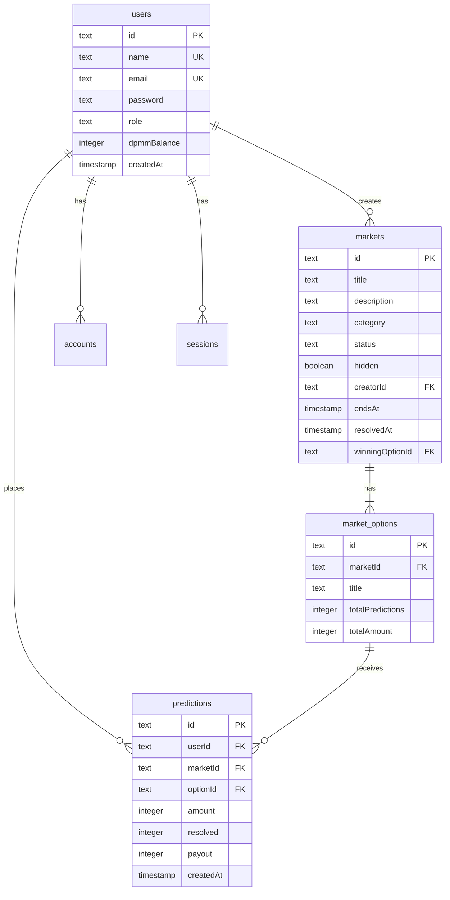

# 도파밈 (Dopameme) - 종합 프로젝트 문서

> 게임처럼 즐기는 예측 플랫폼
> 최종 업데이트: 2025-11-17

---

## 📚 목차

1. [프로젝트 개요](#1-프로젝트-개요)
2. [비즈니스 기획](#2-비즈니스-기획)
3. [기술 아키텍처](#3-기술-아키텍처)
4. [데이터베이스 설계](#4-데이터베이스-설계)
5. [핵심 기능 구현](#5-핵심-기능-구현)
6. [UI/UX 디자인 시스템](#6-uiux-디자인-시스템)
7. [인증 및 보안](#7-인증-및-보안)
8. [배포 및 운영](#8-배포-및-운영)
9. [개발 가이드](#9-개발-가이드)
10. [향후 로드맵](#10-향후-로드맵)

---

## 1. 프로젝트 개요

### 1.1 서비스 정의

**도파밈(Dopameme)**은 사용자들이 정치, 경제, 스포츠, 연예 등 실세계 이벤트의 결과를 예측하고, 게임용 포인트(DPMM)를 사용하여 참여하는 소셜 예측 게임 플랫폼입니다.

### 1.2 핵심 가치 제안

- **🎮 게이미피케이션**: 사행성을 배제한 순수 게임형 예측 플랫폼
- **🧠 집단 지성**: 사용자들의 예측 데이터를 통한 여론 분석
- **🎯 인포테인먼트**: 뉴스와 이슈를 능동적으로 소비하는 새로운 방식
- **💰 안전성**: 현금화 불가능한 포인트 시스템으로 법적 리스크 최소화

### 1.3 타겟 고객

#### Primary Target (핵심)
- **2030 MZ세대**
  - 정치, 사회, 경제 이슈에 관심 많음
  - 밈(Meme) 문화와 게이미피케이션에 익숙
  - 주식, 코인 등 투자에 관심이 있으나 가벼운 경험 선호

#### Secondary Target (확장)
- **이슈 매니아**: 특정 분야(스포츠, 정치, 연예)의 전문 지식을 증명하고 싶은 사용자
- **앱테크 유저**: 포인트 적립 및 활용에 익숙한 사용자

### 1.4 시장 규모 및 성장성

- **글로벌 예측 시장 규모**: $580B
- **연평균 성장률 (CAGR)**: 23.4%
- **AI 예측 정확도**: 87%
- **전세계 사용자**: 150M+

### 1.5 팀 구성

| 역할 | 이름 | 연락처 |
|------|------|--------|
| CEO | 레온 스카이 | - |
| CTO | 밈쭌 | - |
| CPO | 강블리 | - |
| CFO | 제트 | zett@dopameme.kr |

### 1.6 투자 현황

- **리드 투자사**: 프라이머 사제파트너스
- **참여사**: 스파크랩, 본엔젤스벤처파트너스
- **2024년 3월**: 30억원 시드 투자 유치

---

## 2. 비즈니스 기획

### 2.1 비전 및 목표

#### 비전
1. 대한민국 No.1 이슈 예측 '놀이터' 포지셔닝
2. 집단 지성 기반 여론 데이터 허브 구축
3. 사행성 배제한 안전한 게임 플랫폼 제공

#### 목표
사용자들이 뉴스와 이슈를 단순 소비하는 것을 넘어, '예측'이라는 게임을 통해 적극적으로 의견을 표현하고 즐기는 새로운 인포테인먼트 문화 선도

### 2.2 핵심 기능 (Core Features)

#### A. 포인트 시스템 ('도파밈' - DPMM)

**중요**: 현금화 및 외부 전송 불가능 → 사행성 이슈 원천 차단

##### 획득 방법
- 신규 회원가입 웰컴 보너스: **10,000 DPMM**
- 일일 출석체크 (로그인 보너스)
- 예측 게임 참여 보상
- 예측 성공 리워드
- 커뮤니티 활동 (게시글, 댓글)
- 친구 초대 (리퍼럴)

##### 사용 방법
- 예측 게임(마켓) 참여 시 지분 구매
- 프로필 꾸미기 아이템 (뱃지, 칭호)
- 특별 이벤트 마켓 참여권

#### B. 예측 게임 ('밈 마켓' - Meme Market)

##### 마켓 생성 정책
- **초기**: 운영자(Admin)가 직접 시의성 있고 흥미로운 주제로 마켓 생성
- **중기**: 우수 활동자에 한해 마켓 개설 권한 부여

##### 마켓 카테고리
- **정치/사회**: 지지율, 정책, 선거 등
- **경제/금융**: 주가, 환율, 금리 등
- **스포츠/E-sports**: 경기 결과, 우승팀, MVP 등
- **연예/문화**: 박스오피스, 시상식, 차트 등
- **과학기술**: 신제품 출시, 기술 발표 등
- **국제**: 국제 정세, 외교 이슈 등

##### 거래 방식
- **바이너리(Binary) 옵션**: 모든 예측은 'Yes' 또는 'No'로 귀결
- **동적 확률 시스템**:
  - 각 옵션의 확률은 베팅 금액에 비례하여 실시간 변동
  - 예: YES에 60% 베팅, NO에 40% 베팅 → YES 확률 60%, NO 확률 40%
  - 사용자는 현재 확률 기반으로 예측 의사결정

##### 결과 판정
- 이벤트 종료 및 결과 확정 시 관리자가 마켓 종료
- 승리한 옵션 선택자들에게 전체 베팅 풀 분배
- 1% 플랫폼 수수료 부과
- 수수료는 'fee-burn-account'로 집계

##### 보상 계산 공식
```
개인 보상 = (개인 베팅액 / 승리 옵션 총액) × 전체 베팅액 × 0.99
```

**예시**:
- 전체 베팅액: 1,000,000 DPMM
- YES 베팅액: 600,000 DPMM (60%)
- NO 베팅액: 400,000 DPMM (40%)
- 결과: YES 승리
- A 사용자가 YES에 60,000 DPMM 베팅
- A 사용자 보상: (60,000 / 600,000) × 1,000,000 × 0.99 = 99,000 DPMM
- A 사용자 순수익: 99,000 - 60,000 = 39,000 DPMM (65% 수익률)

#### C. 커뮤니티 및 랭킹

##### 순위표 (Leaderboard)
- 보유 포인트 랭킹
- 주간/월간 수익률 랭킹 (향후 구현)
- 예측 성공률 랭킹 (향후 구현)
- 상위 랭커에게 특별 뱃지/칭호 부여

##### 커뮤니티 (향후 구현)
- 마켓별 토론 게시판
- 사용자 간 정보 교환 및 의견 공유

### 2.3 차별화 전략

| 경쟁사 | 도파밈 |
|--------|--------|
| Polymarket, Kalshi: 실제 돈/암호화폐 거래 | **포인트 기반 게임**, 현금화 불가 |
| 금융/도박 성격 강함 | **순수 게임**으로 정의, 사행성 규제 회피 |
| 높은 진입 장벽, 금전적 리스크 | **무료 가입**, 금전적 손실 위험 없음 |
| 전문가 중심 | **밈 문화 + 트렌드** 중심, 대중 친화적 |

### 2.4 비즈니스 모델 (수익화)

#### 1. 광고 (Advertising)
- **배너 광고**: 디스플레이 광고(DA) 게재
- **스폰서 마켓**: 기업/브랜드 협찬 예측 마켓
  - 예: "A사 신제품 첫 주 판매량 10만 대 돌파?"
  - 네이티브 광고 효과

#### 2. B2B 데이터 판매
- 비식별화된 예측 데이터 집계
- 여론 분석 리포트 판매
- 타겟: 기업, 정당, 리서치 기관
- 예: "신규 정책에 대한 20대 남성 여론 추이"

#### 3. 아이템 판매 (향후)
- 프로필 뱃지, 테마 스킨
- 랭킹 부스터
- 과시형/수집형 아이템

---

## 3. 기술 아키텍처

### 3.1 기술 스택

#### Frontend & Backend
```
Framework: Next.js 15 (App Router)
Language: TypeScript 5
Styling: Tailwind CSS 3.4
Runtime: Node.js 20+
```

#### Authentication
```
NextAuth.js v5.0.0-beta.30
- Session-based JWT 인증
- Credentials Provider (이메일/비밀번호)
- Google OAuth Provider
- bcryptjs: 비밀번호 해싱
```

#### Database
```
PostgreSQL (Supabase)
- Drizzle ORM 0.44.7: 타입 안전 쿼리
- Drizzle Kit 0.31.6: 마이그레이션
- postgres 3.4.7: 드라이버
```

#### Deployment
```
Hosting: Vercel
Domain: dopameme.kr
CI/CD: GitHub Actions (자동)
```

### 3.2 프로젝트 구조

```
dopameme.kr/
├── app/                              # Next.js App Router
│   ├── about/                        # 소개 페이지
│   ├── admin/                        # 관리자 기능
│   │   ├── stats/anomalies/          # 이상 거래 탐지
│   │   ├── stats/markets/            # 마켓 통계
│   │   ├── stats/trends/             # 트렌드 분석
│   │   └── markets/
│   │       ├── create/               # 마켓 생성
│   │       └── [id]/
│   │           ├── resolve/          # 결과 확정
│   │           ├── toggle-hidden/    # 가리기/보이기
│   │           └── delete/           # 삭제
│   ├── api/
│   │   ├── auth/[...nextauth]/       # NextAuth API 라우트
│   │   ├── b2b/analytics/            # B2B aggregate analytics API
│   │   ├── push/subscriptions/       # Web Push subscription API
│   │   └── webauthn/                 # WebAuthn/passkey API
│   ├── app/                          # 내 활동, AI 추천, 트렌드 예측, 업적, 레벨, 시즌, 아이템샵, 통계 페이지
│   │   ├── achievements/             # 업적 현황
│   │   ├── level/                    # XP/레벨/보상
│   │   ├── recommendations/          # AI 예측 추천
│   │   ├── seasons/                  # 시즌 챔피언십
│   │   ├── shop/                     # 아이템샵
│   │   ├── security/                 # 계정 보안/패스키 관리
│   │   ├── stats/                    # 사용자 통계 대시보드
│   │   └── trends/                   # 트렌드 예측
│   ├── feed/                         # 활동 피드
│   ├── leaderboard/                  # 순위표
│   ├── locale/                       # locale cookie 설정 Server Action
│   ├── login/                        # 로그인
│   ├── markets/                      # 예측 시장 목록
│   │   └── [id]/                     # 예측 상세
│   ├── notifications/                # 알림함
│   ├── offline/                      # PWA 오프라인 fallback
│   ├── privacy/                      # 개인정보처리방침
│   ├── signup/                       # 회원가입
│   ├── terms/                        # 이용약관
│   ├── globals.css                   # 전역 스타일
│   ├── icon.svg                      # 파비콘
│   ├── layout.tsx                    # 루트 레이아웃
│   ├── manifest.ts                   # Web App Manifest
│   ├── opengraph-image.tsx           # OG 이미지
│   └── page.tsx                      # 랜딩 페이지
│
├── components/                       # 재사용 가능 컴포넌트
│   ├── Header.tsx                    # 헤더 (로고, 네비게이션, DPMM 잔액)
│   ├── LanguageSwitcher.tsx          # KO/EN/JA locale 전환 UI
│   ├── OfflineStatusBanner.tsx       # 오프라인 상태 배너
│   ├── ServiceWorkerRegistration.tsx # Service Worker 등록
│   └── LogoutButton.tsx              # 로그아웃 버튼
│
├── lib/                              # 유틸리티 라이브러리
│   ├── achievements.ts               # 업적 정의/진행률 계산
│   ├── anomaly-detection.ts          # 이상 거래 탐지 score 계산
│   ├── i18n.ts                       # locale/copy/date locale 정의
│   ├── i18n-server.ts                # cookie 기반 현재 locale 조회
│   ├── levels.ts                     # XP/레벨/보상 계산
│   ├── markets/
│   │   └── regions.ts                # 마켓 지역/언어 metadata 정의
│   ├── recommendations.ts            # AI 예측 추천 score 계산
│   ├── seasons.ts                    # 시즌 이벤트/leaderboard 계산
│   ├── shop.ts                       # 아이템샵 catalog/구매/장착
│   ├── trend-predictions.ts          # 트렌드 예측 score 계산
│   ├── db/
│   │   ├── index.ts                  # DB 연결
│   │   └── schema.ts                 # Drizzle 스키마
│   ├── auth-utils.ts                 # 인증 유틸리티
│   └── nickname-generator.ts         # 닉네임 생성기
│
├── mobile/                           # Expo React Native shell
│   ├── App.js                        # production WebView shell
│   ├── app.json                      # Expo app metadata
│   └── package.json                  # mobile runtime dependencies
│
├── scripts/                          # DB 스크립트
│   ├── create-fee-account.sql        # 수수료 계정 생성
│   ├── final-setup.sql               # 최종 설정
│   ├── generate-test-accounts.ts     # 테스트 계정 생성
│   └── ...
│
├── drizzle/                          # DB 마이그레이션
│   ├── meta/                         # 스냅샷
│   └── *.sql                         # SQL 마이그레이션
│
├── public/
│   └── sw.js                         # PWA offline Service Worker
├── auth.ts                           # NextAuth 설정
├── middleware.ts                     # 라우트 보호 (제거됨)
├── tailwind.config.ts                # Tailwind 설정
├── tsconfig.json                     # TypeScript 설정
├── drizzle.config.ts                 # Drizzle 설정
├── package.json                      # 의존성
├── .env.local                        # 환경 변수 (gitignore)
├── README.md                         # 프로젝트 소개
├── dopameme_plan.md                  # 기획서
├── dopameme_dev.md                   # 개발 계획서
└── DOCUMENTATION.md                  # 본 문서
```

### 3.3 라우팅 구조

#### 공개 페이지 (Public Routes)
- `/` - 랜딩 페이지
- `/about` - 서비스 소개
- `/terms` - 이용약관
- `/privacy` - 개인정보처리방침
- `/login` - 로그인
- `/signup` - 회원가입
- `/offline` - 모바일/PWA 오프라인 fallback
- `/manifest.webmanifest` - Web App Manifest

#### 인증 필요 페이지 (Protected Routes)
- `/app` - 내 활동 (내 예측, 포인트 내역, 통계)
- `/app/recommendations` - 활동/시장 신호 기반 AI 예측 추천
- `/app/trends` - 최근 참여/댓글/신규 마켓 기반 트렌드 예측
- `/app/achievements` - 업적 현황 및 다음 목표
- `/app/level` - XP, 레벨, 레벨업 보상 수령
- `/app/seasons` - 월간/분기 시즌 챔피언십 leaderboard
- `/app/shop` - 프로필 테마, 배지, 이모티콘 아이템샵
- `/app/security` - 패스키 등록/삭제 및 계정 보안
- `/app/stats` - 사용자 통계 대시보드
- `/feed` - 팔로우한 회원들의 공개 활동 피드
- `/markets` - 예측 시장 목록
- `/markets/[id]` - 예측 상세 및 마켓 토론
- `/notifications` - 새 팔로워와 내 마켓 댓글 알림함
- `/users/[id]` - 사용자 프로필
- `/leaderboard` - 순위표

#### 관리자 전용 페이지 (Admin Only)
- `/admin` - 운영 대시보드
- `/admin/markets` - 마켓 관리
- `/admin/stats/markets` - 마켓 통계
- `/admin/stats/trends` - 트렌드 분석
- `/admin/stats/anomalies` - 이상 거래 탐지
- `/admin/markets/create` - 마켓 생성
- `/admin/markets/[id]/resolve` - 결과 확정
- `/admin/markets/[id]/toggle-hidden` - 가리기/보이기
- `/admin/markets/[id]/delete` - 삭제

#### API Routes
- `/api/b2b/analytics` - 비식별 aggregate 마켓/카테고리/트렌드 데이터
- `/api/push/subscriptions` - 로그인 사용자 Web Push 구독 등록/해제
- `/api/webauthn/register/options` - 로그인 사용자 패스키 등록 옵션 생성
- `/api/webauthn/register/verify` - 로그인 사용자 패스키 등록 검증
- `/api/webauthn/authenticate/options` - 패스키 로그인 옵션 생성

### 3.4 모바일/PWA/React Native 기반

도파밈은 현재 Next.js 서비스의 PWA 기반과 Expo React Native shell을 함께 둔다. native app은 production origin인 `https://dopameme.kr`만 WebView로 로드하는 얇은 shell이며, 핵심 서비스 로직과 인증은 web origin에서 계속 처리한다.

- `app/manifest.ts`: 홈 화면 설치용 Web App Manifest를 제공한다.
- `components/ServiceWorkerRegistration.tsx`: HTTPS, localhost, 127.0.0.1 환경에서만 Service Worker를 등록한다.
- `public/sw.js`: navigation 요청 실패 시 정적 offline HTML fallback을 반환한다.
- `app/offline/page.tsx`: 네트워크 단절 시 사용자에게 복구 안내와 주요 진입 링크를 제공한다.
- `components/OfflineStatusBanner.tsx`: 브라우저가 offline 상태로 전환되면 전역 안내 배너를 표시한다.
- `app/api/push/subscriptions/route.ts`: 로그인 사용자의 브라우저 push subscription을 등록/해제한다.
- `lib/push.ts`: VAPID 설정과 subscription별 Web Push 발송을 담당한다.
- `app/app/security/page.tsx`: WebAuthn/passkey 등록과 삭제를 제공한다.
- `lib/webauthn.ts`: WebAuthn challenge 생성, origin/rpID 검증, credential counter 갱신을 담당한다.
- `mobile/App.js`: Expo WebView shell, origin allowlist, native toolbar, retry state를 제공한다.
- `mobile/app.json`: iOS/Android package id, scheme, production origin metadata를 정의한다.

캐시 정책은 보수적으로 유지한다. cookie-locale HTML route는 Cache API에 저장하지 않고 network-only로 처리한다. `/manifest.webmanifest`, `/icon.svg`만 precache 또는 runtime cache 대상으로 삼고, 인증 페이지·API 응답·사용자별 데이터는 cache하지 않는다.
푸시 payload는 알림 제목, 요약, 내부 URL만 포함하고, 외부 URL은 Service Worker에서 `/notifications`로 fallback한다.
패스키는 WebAuthn user verification을 요구하며, challenge는 5분 만료 후 재사용할 수 없다.
React Native shell은 `dopameme.kr` 외부 URL을 system browser로 위임한다. WebView에서 passkey가 제한되는 기기는 toolbar의 browser fallback을 사용한다.

### 3.5 Server Actions 아키텍처

Next.js 15의 Server Actions를 활용한 API-less 아키텍처:

```typescript
// app/markets/[id]/actions.ts
'use server'

export async function placePrediction(formData) {
  // 1. 인증 확인
  const session = await auth()

  // 2. 데이터 검증
  // 3. 트랜잭션 처리
  await db.transaction(async (tx) => {
    // - 예측 생성
    // - 잔액 차감
    // - 통계 업데이트
  })

  // 4. 캐시 재검증
  revalidatePath('/markets')

  return { success: true }
}
```

**장점**:
- API 라우트 불필요
- 타입 안전성 보장
- 자동 에러 처리
- 코드 분할 최적화

---

## 4. 데이터베이스 설계

### 4.1 ERD (Entity Relationship Diagram)

```
┌──────────────┐         ┌──────────────────┐         ┌──────────────────┐
│    users     │────1:N──│   predictions    │──N:1────│ market_options   │
└──────────────┘         └──────────────────┘         └──────────────────┘
       │                                                        │
       │                  ┌──────────────────┐                 │
       └──────────────────│     markets      │─────────────────┘
                          └──────────────────┘
                                   │
                                   │
                          ┌──────────────────┐
                          │    accounts      │
                          └──────────────────┘
                          ┌──────────────────┐
                          │    sessions      │
                          └──────────────────┘

┌──────────────┐         ┌──────────────────┐         ┌──────────────┐
│ follower     │────1:N──│   user_follows   │──N:1────│ following    │
│ users        │         │                  │         │ users        │
└──────────────┘         └──────────────────┘         └──────────────┘
```

### 4.2 테이블 스키마

#### users (사용자)

| 컬럼명 | 타입 | 제약조건 | 설명 |
|--------|------|----------|------|
| id | text | PRIMARY KEY | UUID |
| name | text | UNIQUE | 닉네임 (영문+특수문자 12자) |
| email | text | UNIQUE | 이메일 |
| emailVerified | timestamp | - | 이메일 인증 시간 |
| image | text | - | 프로필 이미지 URL |
| password | text | - | 해시화된 비밀번호 (Credentials 로그인용) |
| role | text | DEFAULT 'user' | 역할 (user, admin, test) |
| dpmmBalance | integer | DEFAULT 10000 | DPMM 잔액 (웰컴 보너스) |
| createdAt | timestamp | DEFAULT NOW() | 가입 일시 |

**인덱스**:
- PRIMARY KEY: `id`
- UNIQUE: `email`, `name`

#### user_follows (사용자 팔로우)

| 컬럼명 | 타입 | 제약조건 | 설명 |
|--------|------|----------|------|
| id | text | PRIMARY KEY | UUID |
| followerId | text | FK → users.id | 팔로우를 건 사용자 ID |
| followingId | text | FK → users.id | 팔로우 대상 사용자 ID |
| createdAt | timestamp | DEFAULT NOW() | 팔로우 생성 일시 |

**인덱스**:
- UNIQUE: `(followerId, followingId)`
- INDEX: `followerId`, `followingId`, `createdAt`
- CHECK: `followerId <> followingId`

#### notifications (알림)

| 컬럼명 | 타입 | 제약조건 | 설명 |
|--------|------|----------|------|
| id | text | PRIMARY KEY | UUID |
| userId | text | FK → users.id | 알림 수신자 ID |
| actorId | text | FK → users.id | 알림 발생 사용자 ID |
| type | text | NOT NULL | 알림 타입 |
| title | text | NOT NULL | 알림 제목 |
| body | text | - | 알림 보조 내용 |
| targetType | text | - | 연결 대상 타입 |
| targetId | text | - | 연결 대상 ID |
| targetPath | text | - | 클릭 시 이동 경로 |
| readAt | timestamp | - | 읽음 처리 시간 |
| createdAt | timestamp | DEFAULT NOW() | 알림 생성 일시 |

**인덱스**:
- INDEX: `(userId, readAt, createdAt)`, `(userId, createdAt)`
- INDEX: `actorId`, `(targetType, targetId)`

#### push_subscriptions (브라우저 푸시 구독)

| 컬럼명 | 타입 | 제약조건 | 설명 |
|--------|------|----------|------|
| id | text | PRIMARY KEY | UUID |
| userId | text | FK → users.id | 구독 소유 사용자 ID |
| endpoint | text | UNIQUE | 브라우저 push endpoint |
| p256dh | text | NOT NULL | Push encryption public key |
| auth | text | NOT NULL | Push auth secret |
| userAgent | text | - | 등록 브라우저 user-agent |
| enabled | boolean | DEFAULT true | 발송 대상 여부 |
| failureCount | integer | DEFAULT 0 | 발송 실패 누적 수 |
| failedAt | timestamp | - | 마지막 발송 실패 시각 |
| lastUsedAt | timestamp | - | 마지막 발송 성공 시각 |
| createdAt | timestamp | DEFAULT NOW() | 구독 생성 일시 |
| updatedAt | timestamp | UPDATED AT | 구독 갱신 일시 |

**인덱스**:
- UNIQUE: `endpoint`
- INDEX: `(userId, enabled)`, `updatedAt`
- CHECK: `failureCount >= 0`

#### webauthn_credentials (패스키 인증 정보)

| 컬럼명 | 타입 | 제약조건 | 설명 |
|--------|------|----------|------|
| id | text | PRIMARY KEY | UUID |
| userId | text | FK → users.id | 소유 사용자 ID |
| credentialId | text | UNIQUE | WebAuthn credential ID |
| publicKey | text | NOT NULL | WebAuthn public key |
| counter | integer | DEFAULT 0 | replay 방지 counter |
| transports | text | - | authenticator transports JSON |
| deviceType | text | - | singleDevice / multiDevice |
| backedUp | boolean | DEFAULT false | multi-device credential backup 여부 |
| name | text | - | 사용자 표시 이름 |
| lastUsedAt | timestamp | - | 마지막 사용 시각 |
| createdAt | timestamp | DEFAULT NOW() | 등록 일시 |
| updatedAt | timestamp | UPDATED AT | 갱신 일시 |

**인덱스**:
- UNIQUE: `credentialId`
- INDEX: `userId`, `lastUsedAt`
- CHECK: `counter >= 0`

#### webauthn_challenges (패스키 challenge)

| 컬럼명 | 타입 | 제약조건 | 설명 |
|--------|------|----------|------|
| id | text | PRIMARY KEY | UUID |
| userId | text | FK → users.id | challenge 소유 사용자 ID |
| email | text | - | 로그인 시 이메일 |
| type | text | registration/authentication | challenge 용도 |
| challenge | text | UNIQUE | WebAuthn challenge |
| expiresAt | timestamp | NOT NULL | 만료 시각 |
| consumedAt | timestamp | - | 사용 완료 시각 |
| createdAt | timestamp | DEFAULT NOW() | 생성 일시 |

**인덱스**:
- UNIQUE: `challenge`
- INDEX: `(userId, type, expiresAt)`, `(email, type, expiresAt)`, `expiresAt`
- CHECK: `type IN ('registration', 'authentication')`

#### achievement_definitions (업적 정의)

| 컬럼명 | 타입 | 제약조건 | 설명 |
|--------|------|----------|------|
| id | text | PRIMARY KEY | UUID |
| code | text | UNIQUE | 업적 코드 |
| title | text | NOT NULL | 표시 제목 |
| description | text | NOT NULL | 표시 설명 |
| category | text | NOT NULL | prediction / accuracy / profit / volume / community |
| icon | text | NOT NULL | UI 표시용 짧은 아이콘 텍스트 |
| threshold | integer | CHECK > 0 | 달성 기준값 |
| rewardDpmm | integer | DEFAULT 0 | 향후 보상용 DPMM metadata |
| isActive | boolean | DEFAULT true | 노출/집계 여부 |
| sortOrder | integer | DEFAULT 0 | 노출 순서 |
| createdAt | timestamp | DEFAULT NOW() | 생성 일시 |
| updatedAt | timestamp | UPDATED AT | 갱신 일시 |

**인덱스**:
- UNIQUE: `code`
- INDEX: `(category, isActive)`, `sortOrder`

#### user_achievements (사용자 업적 진행률)

| 컬럼명 | 타입 | 제약조건 | 설명 |
|--------|------|----------|------|
| id | text | PRIMARY KEY | UUID |
| userId | text | FK → users.id | 사용자 ID |
| achievementId | text | FK → achievement_definitions.id | 업적 정의 ID |
| progress | integer | CHECK >= 0 | 현재 진행값 |
| unlockedAt | timestamp | - | 달성 시각 |
| createdAt | timestamp | DEFAULT NOW() | 생성 일시 |
| updatedAt | timestamp | UPDATED AT | 갱신 일시 |

**인덱스**:
- UNIQUE: `(userId, achievementId)`
- INDEX: `(userId, unlockedAt)`, `achievementId`

#### level_definitions (레벨 정의)

| 컬럼명 | 타입 | 제약조건 | 설명 |
|--------|------|----------|------|
| id | text | PRIMARY KEY | UUID |
| level | integer | UNIQUE, CHECK > 0 | 레벨 번호 |
| title | text | NOT NULL | 레벨 이름 |
| minXp | integer | CHECK >= 0 | 해당 레벨 최소 XP |
| rewardDpmm | integer | DEFAULT 0 | 레벨 달성 보상 DPMM |
| isActive | boolean | DEFAULT true | 노출/집계 여부 |
| createdAt | timestamp | DEFAULT NOW() | 생성 일시 |
| updatedAt | timestamp | UPDATED AT | 갱신 일시 |

**인덱스**:
- UNIQUE: `level`
- INDEX: `minXp`, `isActive`

#### user_levels (사용자 레벨 snapshot)

| 컬럼명 | 타입 | 제약조건 | 설명 |
|--------|------|----------|------|
| id | text | PRIMARY KEY | UUID |
| userId | text | FK → users.id, UNIQUE | 사용자 ID |
| xp | integer | CHECK >= 0 | 누적 XP |
| level | integer | CHECK > 0 | 현재 레벨 |
| rewardedLevel | integer | CHECK > 0 | 보상 수령 완료 레벨 |
| lastCalculatedAt | timestamp | DEFAULT NOW() | 마지막 XP 계산 시각 |
| createdAt | timestamp | DEFAULT NOW() | 생성 일시 |
| updatedAt | timestamp | UPDATED AT | 갱신 일시 |

**인덱스**:
- UNIQUE: `userId`
- INDEX: `level`, `xp`

#### season_events (시즌 이벤트)

| 컬럼명 | 타입 | 제약조건 | 설명 |
|--------|------|----------|------|
| id | text | PRIMARY KEY | UUID |
| code | text | UNIQUE | 시즌 코드 |
| title | text | NOT NULL | 표시 제목 |
| description | text | NOT NULL | 표시 설명 |
| type | text | monthly / quarterly | 시즌 유형 |
| status | text | active / completed / archived | 상태 |
| startsAt | timestamp | NOT NULL | 시작 시각 |
| endsAt | timestamp | NOT NULL | 종료 시각 |
| rewardDpmm | integer | DEFAULT 0 | 시즌 보상 pool metadata |
| sortOrder | integer | DEFAULT 0 | 노출 순서 |
| createdAt | timestamp | DEFAULT NOW() | 생성 일시 |
| updatedAt | timestamp | UPDATED AT | 갱신 일시 |

**인덱스**:
- UNIQUE: `code`
- INDEX: `(type, startsAt)`, `(status, startsAt, endsAt)`, `sortOrder`

#### user_season_progress (사용자 시즌 점수)

| 컬럼명 | 타입 | 제약조건 | 설명 |
|--------|------|----------|------|
| id | text | PRIMARY KEY | UUID |
| userId | text | FK → users.id | 사용자 ID |
| seasonId | text | FK → season_events.id | 시즌 ID |
| score | integer | CHECK >= 0 | 시즌 점수 |
| predictionCount | integer | CHECK >= 0 | 시즌 예측 수 |
| winCount | integer | CHECK >= 0 | 시즌 적중 수 |
| stakeAmount | integer | CHECK >= 0 | 시즌 참여 DPMM |
| profitAmount | integer | - | 시즌 정산 손익 |
| commentCount | integer | CHECK >= 0 | 시즌 댓글 수 |
| lastCalculatedAt | timestamp | DEFAULT NOW() | 마지막 계산 시각 |
| createdAt | timestamp | DEFAULT NOW() | 생성 일시 |
| updatedAt | timestamp | UPDATED AT | 갱신 일시 |

**인덱스**:
- UNIQUE: `(userId, seasonId)`
- INDEX: `(seasonId, score)`, `userId`

#### shop_items (아이템샵 catalog)

| 컬럼명 | 타입 | 제약조건 | 설명 |
|--------|------|----------|------|
| id | text | PRIMARY KEY | UUID |
| code | text | UNIQUE | 아이템 코드 |
| name | text | NOT NULL | 표시 이름 |
| description | text | NOT NULL | 설명 |
| category | text | profile_theme / badge / emote | 아이템 유형 |
| rarity | text | common / rare / epic | 희귀도 |
| priceDpmm | integer | CHECK >= 0 | 구매 가격 |
| previewText | text | NOT NULL | 미리보기 텍스트 |
| sortOrder | integer | DEFAULT 0 | 노출 순서 |
| isActive | boolean | DEFAULT true | 판매 여부 |
| createdAt | timestamp | DEFAULT NOW() | 생성 일시 |
| updatedAt | timestamp | UPDATED AT | 갱신 일시 |

**인덱스**:
- UNIQUE: `code`
- INDEX: `(category, sortOrder)`, `isActive`

#### user_shop_items (사용자 보유 아이템)

| 컬럼명 | 타입 | 제약조건 | 설명 |
|--------|------|----------|------|
| id | text | PRIMARY KEY | UUID |
| userId | text | FK → users.id | 사용자 ID |
| itemId | text | FK → shop_items.id | 아이템 ID |
| isEquipped | boolean | DEFAULT false | 장착 여부 |
| purchasedAt | timestamp | DEFAULT NOW() | 구매 시각 |
| updatedAt | timestamp | UPDATED AT | 갱신 일시 |

**인덱스**:
- UNIQUE: `(userId, itemId)`
- INDEX: `(userId, isEquipped)`, `itemId`

#### accounts (OAuth 계정)

NextAuth.js Drizzle Adapter 표준 스키마

| 컬럼명 | 타입 | 제약조건 | 설명 |
|--------|------|----------|------|
| userId | text | FK → users.id | 사용자 ID |
| type | text | NOT NULL | 계정 타입 |
| provider | text | NOT NULL | OAuth 제공자 (google) |
| providerAccountId | text | NOT NULL | 제공자 계정 ID |
| refresh_token | text | - | 리프레시 토큰 |
| access_token | text | - | 액세스 토큰 |
| expires_at | integer | - | 만료 시간 |
| token_type | text | - | 토큰 타입 |
| scope | text | - | 스코프 |
| id_token | text | - | ID 토큰 |
| session_state | text | - | 세션 상태 |

**인덱스**:
- COMPOSITE PRIMARY KEY: `(provider, providerAccountId)`

#### sessions (세션)

NextAuth.js 세션 관리 (현재 JWT 전략 사용으로 미사용)

| 컬럼명 | 타입 | 제약조건 | 설명 |
|--------|------|----------|------|
| sessionToken | text | PRIMARY KEY | 세션 토큰 |
| userId | text | FK → users.id | 사용자 ID |
| expires | timestamp | NOT NULL | 만료 시간 |

#### markets (예측 마켓)

| 컬럼명 | 타입 | 제약조건 | 설명 |
|--------|------|----------|------|
| id | text | PRIMARY KEY | UUID |
| title | text | NOT NULL | 마켓 제목 |
| description | text | NOT NULL | 상세 설명 |
| category | text | NOT NULL | 카테고리 (정치, 경제, 스포츠 등) |
| imageUrl | text | - | 대표 이미지 URL |
| status | text | DEFAULT 'active' | 상태 (active, closed, resolved) |
| hidden | boolean | DEFAULT false | 관리자 숨김 여부 |
| creatorId | text | FK → users.id | 생성자 ID |
| createdAt | timestamp | DEFAULT NOW() | 생성 일시 |
| endsAt | timestamp | NOT NULL | 마감 일시 |
| resolvedAt | timestamp | - | 결과 확정 일시 |
| winningOptionId | text | - | 승리 옵션 ID |

**인덱스**:
- PRIMARY KEY: `id`
- INDEX: `status`, `category`, `createdAt`

#### market_options (마켓 옵션)

| 컬럼명 | 타입 | 제약조건 | 설명 |
|--------|------|----------|------|
| id | text | PRIMARY KEY | UUID |
| marketId | text | FK → markets.id | 마켓 ID |
| title | text | NOT NULL | 옵션 제목 (마켓당 2-6개) |
| totalPredictions | integer | DEFAULT 0 | 총 예측 수 |
| totalAmount | integer | DEFAULT 0 | 총 베팅 금액 (DPMM) |
| createdAt | timestamp | DEFAULT NOW() | 생성 일시 |

**인덱스**:
- PRIMARY KEY: `id`
- UNIQUE: `(marketId, title)`
- INDEX: `marketId`

#### predictions (사용자 예측)

| 컬럼명 | 타입 | 제약조건 | 설명 |
|--------|------|----------|------|
| id | text | PRIMARY KEY | UUID |
| userId | text | FK → users.id | 사용자 ID |
| marketId | text | FK → markets.id | 마켓 ID |
| optionId | text | FK → market_options.id | 선택 옵션 ID |
| amount | integer | NOT NULL | 현재 남은 베팅 금액 (DPMM) |
| liquidatedAmount | integer | DEFAULT 0 | 누적 부분 청산 금액 |
| createdAt | timestamp | DEFAULT NOW() | 예측 일시 |
| resolved | integer | DEFAULT 0 | 결과 (0: 대기, 1: 승리, -1: 패배) |
| payout | integer | DEFAULT 0 | 지급액 (DPMM) |

**인덱스**:
- PRIMARY KEY: `id`
- INDEX: `userId`, `marketId`, `optionId`
- COMPOSITE INDEX: `(userId, marketId)` - 중복 베팅 방지

#### position_listings (포지션 2차 거래)

| 컬럼명 | 타입 | 제약조건 | 설명 |
|--------|------|----------|------|
| id | text | PRIMARY KEY | UUID |
| sellerId | text | FK → users.id | 판매자 ID |
| buyerId | text | FK → users.id | 구매자 ID |
| predictionId | text | FK → predictions.id | 양도 대상 포지션 |
| marketId | text | FK → markets.id | 마켓 ID |
| optionId | text | FK → market_options.id | 선택 옵션 ID |
| amount | integer | NOT NULL | 판매 등록 시점 포지션 금액 |
| price | integer | NOT NULL | 판매가 |
| status | text | DEFAULT active | active / sold / cancelled |
| createdAt | timestamp | DEFAULT NOW() | 판매 등록 일시 |
| soldAt | timestamp | - | 판매 완료 일시 |
| cancelledAt | timestamp | - | 판매 취소 일시 |

**인덱스**:
- PRIMARY KEY: `id`
- UNIQUE PARTIAL: `predictionId WHERE status = active`
- INDEX: `sellerId`, `buyerId`, `predictionId`, `(marketId, status, createdAt)`

#### market_price_snapshots (마켓 가격 스냅샷)

| 컬럼명 | 타입 | 제약조건 | 설명 |
|--------|------|----------|------|
| id | text | PRIMARY KEY | UUID |
| marketId | text | FK → markets.id | 마켓 ID |
| optionId | text | FK → market_options.id | 선택 옵션 ID |
| probabilityBps | integer | 0~10000 | 옵션 확률. 10000 = 100% |
| optionAmount | integer | NOT NULL | 스냅샷 시점 옵션 총액 |
| totalAmount | integer | NOT NULL | 스냅샷 시점 마켓 총액 |
| source | text | NOT NULL | prediction_stake / prediction_liquidation 등 |
| createdAt | timestamp | DEFAULT NOW() | 스냅샷 생성 일시 |

**인덱스**:
- PRIMARY KEY: `id`
- INDEX: `(marketId, createdAt)`, `(optionId, createdAt)`, `source`

#### market_amm_configs (AMM 설정)

| 컬럼명 | 타입 | 제약조건 | 설명 |
|--------|------|----------|------|
| id | text | PRIMARY KEY | UUID |
| marketId | text | UNIQUE, FK → markets.id | 마켓 ID |
| enabled | boolean | DEFAULT true | AMM quote layer 사용 여부 |
| virtualLiquidity | integer | DEFAULT 5000 | 옵션별 가상 유동성 |
| createdAt | timestamp | DEFAULT NOW() | 생성 일시 |
| updatedAt | timestamp | AUTO UPDATE | 수정 일시 |

**인덱스**:
- UNIQUE: `marketId`
- INDEX: `enabled`

### 4.3 주요 쿼리 패턴

#### 예측 참여 (트랜잭션)

```typescript
await db.transaction(async (tx) => {
  // 1. 예측 레코드 생성
  await tx.insert(predictions).values({
    userId, marketId, optionId, amount
  })

  // 2. 사용자 잔액 차감
  await tx.update(users)
    .set({ dpmmBalance: sql`${users.dpmmBalance} - ${amount}` })
    .where(eq(users.id, userId))

  // 3. 옵션 통계 업데이트
  await tx.update(marketOptions)
    .set({
      totalPredictions: sql`${marketOptions.totalPredictions} + 1`,
      totalAmount: sql`${marketOptions.totalAmount} + ${amount}`
    })
    .where(eq(marketOptions.id, optionId))
})
```

#### 마켓 결과 확정 (트랜잭션)

```typescript
await db.transaction(async (tx) => {
  // 1. 마켓 상태 업데이트
  await tx.update(markets).set({
    status: 'resolved',
    resolvedAt: new Date(),
    winningOptionId
  }).where(eq(markets.id, marketId))

  // 2. 승리자들에게 보상 지급 (1% 수수료 공제)
  for (const prediction of winnerPredictions) {
    const grossPayout = (prediction.amount / winningTotal) * totalBet
    const fee = Math.floor(grossPayout * 0.01)
    const netPayout = grossPayout - fee

    await tx.update(predictions).set({
      resolved: 1,
      payout: netPayout
    }).where(eq(predictions.id, prediction.id))

    await tx.update(users).set({
      dpmmBalance: sql`${users.dpmmBalance} + ${netPayout}`
    }).where(eq(users.id, prediction.userId))
  }

  // 3. 수수료 소각 계정에 입금
  await tx.update(users).set({
    dpmmBalance: sql`${users.dpmmBalance} + ${totalFees}`
  }).where(eq(users.id, 'fee-burn-account'))

  // 4. 패배자 예측 업데이트
  await tx.update(predictions).set({
    resolved: -1,
    payout: 0
  }).where(sql`...`)
})
```

---

## 5. 핵심 기능 구현

### 5.1 인증 시스템

#### 5.1.1 NextAuth.js 설정 (`auth.ts`)

```typescript
export const { handlers, signIn, signOut, auth } = NextAuth({
  adapter: DrizzleAdapter(db),
  session: { strategy: 'jwt' },
  providers: [
    Google({
      clientId: process.env.GOOGLE_CLIENT_ID,
      clientSecret: process.env.GOOGLE_CLIENT_SECRET,
    }),
    Credentials({
      async authorize(credentials) {
        const user = await db.select()
          .from(users)
          .where(eq(users.email, credentials.email))

        if (!user[0].password) {
          throw new Error('다른 로그인 방법을 사용해주세요')
        }

        const isValid = await bcrypt.compare(
          credentials.password,
          user[0].password
        )

        if (!isValid) throw new Error('비밀번호 오류')

        return user[0]
      }
    })
  ],
  callbacks: {
    jwt({ token, user }) {
      if (user) token.id = user.id
      return token
    },
    session({ session, token }) {
      session.user.id = token.id
      return session
    }
  }
})
```

#### 5.1.2 회원가입 Flow

1. **프론트엔드** (`app/signup/page.tsx`):
   - 이메일, 비밀번호, 비밀번호 확인 입력
   - 클라이언트 유효성 검증

2. **서버 액션** (`app/signup/actions.ts`):
   ```typescript
   export async function signUpAction(formData) {
     // 1. 이메일 중복 확인
     // 2. 비밀번호 해싱 (bcrypt)
     // 3. 랜덤 닉네임 생성
     // 4. 사용자 생성 (웰컴 보너스 10,000 DPMM)
     // 5. 자동 로그인 (signIn)
   }
   ```

3. **닉네임 생성** (`lib/nickname-generator.ts`):
   - 형용사 + 명사 조합 (예: "HappyPanda")
   - 중복 방지 로직

#### 5.1.3 로그인 Flow

**Credentials 로그인**:
```typescript
await signIn('credentials', {
  email,
  password,
  redirectTo: '/app'
})
```

**Google OAuth**:
```typescript
await signIn('google', {
  redirectTo: '/app'
})
```

#### 5.1.4 권한 검증

**관리자 권한 확인** (`lib/auth-utils.ts`):
```typescript
export async function requireAdmin() {
  const session = await auth()

  const [user] = await db.select()
    .from(users)
    .where(eq(users.id, session.user.id))

  if (user.role !== 'admin') {
    throw new Error('관리자 권한이 필요합니다')
  }

  return user
}
```

### 5.2 예측 시스템

#### 5.2.1 마켓 목록 조회

**파일**: `app/markets/page.tsx`

```typescript
// 카테고리별 필터링
const filteredMarkets = await db.select()
  .from(markets)
  .leftJoin(marketOptions, eq(markets.id, marketOptions.marketId))
  .leftJoin(users, eq(markets.creatorId, users.id))
  .where(
    and(
      eq(markets.status, 'active'),
      eq(markets.hidden, false),
      category ? eq(markets.category, category) : undefined
    )
  )
  .orderBy(desc(markets.createdAt))
```

**기능**:
- 카테고리 필터링 (전체, 정치, 경제, 스포츠 등)
- Active 마켓만 표시
- Hidden 마켓 제외 (관리자는 볼 수 있음)
- 최신순 정렬

#### 5.2.2 마켓 상세 페이지

**파일**: `app/markets/[id]/page.tsx`

**표시 정보**:
- 마켓 제목, 설명, 카테고리
- 마감 시간 (Countdown)
- 각 옵션의 현재 확률
- 총 베팅액, 참여자 수
- 사용자의 예측 참여 폼
- 참여한 포지션의 부분 청산 폼
- 판매 등록된 포지션 2차 거래 목록
- 옵션별 가격 차트

**확률 계산**:
```typescript
const yesTotal = yesOption.totalAmount
const noTotal = noOption.totalAmount
const total = yesTotal + noTotal

const yesPercent = total > 0 ? (yesTotal / total) * 100 : 50
const noPercent = total > 0 ? (noTotal / total) * 100 : 50
```

#### 5.2.3 부분 청산

**파일**: `app/markets/[id]/actions.ts`

**정책**:
- active, hidden=false, 마감 전 마켓에서만 가능
- 본인 unresolved prediction만 청산 가능
- 청산 후 최소 100 DPMM은 포지션에 남겨야 함
- 청산 금액의 1%를 수수료로 fee-burn account에 기록

**데이터 변경**:
- `prediction.amount` 감소
- `prediction.liquidatedAmount` 증가
- `market_options.totalAmount` 감소
- 사용자 DPMM 잔액 증가
- `prediction_liquidation`, `prediction_liquidation_fee` ledger 기록

#### 5.2.4 포지션 양도

**파일**: `app/markets/[id]/actions.ts`

**정책**:
- active, hidden=false, 마감 전 마켓에서만 가능
- 판매자는 본인 unresolved prediction 전체를 고정가로 등록
- 포지션당 active 판매 등록은 하나만 허용
- 구매자는 같은 마켓에 기존 포지션이 없어야 함
- 구매 시 `prediction.userId`가 구매자로 이전됨
- 판매가의 1%를 수수료로 fee-burn account에 기록

**데이터 변경**:
- `position_listings` 생성 / sold / cancelled 상태 관리
- 구매자 DPMM 잔액 차감
- 판매자 DPMM 잔액 증가
- `prediction.userId`를 구매자로 변경
- `position_purchase`, `position_sale`, `position_sale_fee` ledger 기록
- 판매자에게 `position_sold` 알림 생성

#### 5.2.5 가격 차트

**파일**:
- `lib/markets/price-snapshots.ts`
- `app/markets/[id]/MarketPriceChart.tsx`
- `app/markets/[id]/MarketLiveRefresh.tsx`

**정책**:
- 예측 참여와 부분 청산처럼 확률을 바꾸는 이벤트 후 option별 스냅샷 기록
- `probabilityBps`는 10000 기준 정수로 저장
- 마켓 상세 페이지는 최근 스냅샷을 SVG 차트로 표시
- active, hidden=false, 마감 전 마켓은 30초 간격으로 `router.refresh()` 실행

**제약사항**:
- WebSocket/SSE push는 아직 미도입
- full share-based payout AMM과 liquidity pool은 별도 단계

#### 5.2.6 AMM 가격 레이어

**파일**:
- `lib/markets/amm.ts`
- `app/markets/[id]/PredictionForm.tsx`

**정책**:
- 옵션별 실제 베팅액에 `virtualLiquidity`를 더해 확률을 계산
- 기본 가상 유동성은 옵션당 5,000 DPMM
- 예측 참여 폼은 입력 금액 기준 AMM 평균가와 예상 확률 변화를 표시
- 마켓 목록, 랜딩, 상세의 확률 표시는 AMM 확률을 사용

**제약사항**:
- 정산은 기존 pool 기반 payout을 유지
- 예측 구매가와 정산 payout을 완전 분리한 MVP 단계
- collateralized share payout AMM은 별도 경제 모델 승인이 필요

#### 5.2.7 예측 참여

**파일**: `app/markets/[id]/actions.ts`

**검증 로직**:
1. ✅ 로그인 확인
2. ✅ 베팅 금액 범위 (100 ~ 10,000 DPMM)
3. ✅ 사용자 잔액 확인
4. ✅ 마켓 상태 확인 (active)
5. ✅ 마감 시간 확인
6. ✅ 중복 베팅 방지 (한 마켓당 1회만)

**트랜잭션 처리**:
- 예측 레코드 생성
- 사용자 잔액 차감
- 옵션 통계 업데이트 (totalPredictions, totalAmount)
- 캐시 재검증 (`revalidatePath`)

**제약사항**:
- 한 마켓당 하나의 포지션만 가능
- active, hidden=false, 마감 전 마켓에서는 일부 stake 청산 가능

#### 5.2.8 마켓 토론 댓글

**파일**: `app/markets/[id]/actions.ts`

**Flow**:
1. 로그인 및 활성 계정 확인
2. 댓글 길이 검증 (2~500자)
3. 사용자/마켓/IP 단위 rate limit 적용
4. 숨김 마켓은 관리자만 댓글 작성 가능
5. `market_comments`에 visible 댓글 저장 후 마켓 상세 재검증

**표시 정책**:
- 마켓 상세에서 visible 댓글 최신 30개 표시
- 댓글 본문은 React 렌더링 escape와 `whitespace-pre-wrap`으로 표시
- 삭제/블라인드 등 고급 moderation은 이후 관리자 기능에서 확장

#### 5.2.9 결과 확정 (Admin)

**파일**: `app/admin/markets/[id]/resolve/actions.ts`

**Flow**:
1. 관리자 권한 확인 (`requireAdmin()`)
2. 마켓 상태 확인 (이미 확정되지 않았는지)
3. 승리 옵션 유효성 검증
4. 트랜잭션 처리:
   - 마켓 상태 → 'resolved'
   - 승리자들에게 보상 계산 및 지급 (1% 수수료 공제)
   - 수수료 → fee-burn-account
   - 패배자 예측 → resolved: -1

**보상 분배 알고리즘**:
```typescript
const totalBetAmount = allOptions.reduce((sum, opt) => sum + opt.totalAmount, 0)
const winningTotalAmount = winningOption.totalAmount

for (const prediction of winnerPredictions) {
  const grossPayout = Math.floor(
    (prediction.amount / winningTotalAmount) * totalBetAmount
  )
  const fee = Math.floor(grossPayout * 0.01)
  const netPayout = grossPayout - fee

  // 사용자에게 netPayout 지급
}
```

### 5.3 관리자 기능

#### 5.3.1 마켓 생성

**파일**: `app/admin/markets/create/page.tsx`

**필수 입력**:
- 제목 (title)
- 설명 (description)
- 카테고리 (category)
- 마감 일시 (endsAt)
- 선택지 2-6개 (기본: YES, NO)

**자동 설정**:
- creatorId: 현재 로그인한 관리자
- status: 'active'
- hidden: false

#### 5.3.2 마켓 가리기/보이기

**파일**: `app/admin/markets/[id]/toggle-hidden/actions.ts`

**기능**:
- 문제가 있는 마켓을 일반 사용자에게 숨김
- 관리자는 계속 볼 수 있음
- 삭제 전 안전장치 (가려진 마켓만 삭제 가능)

**UI**:
- 마켓 상세 페이지에 "가리기/보이기" 버튼 (관리자만 표시)
- 가려진 마켓은 배경색 변경 (노란색)

#### 5.3.3 마켓 삭제

**파일**: `app/admin/markets/[id]/delete/actions.ts`

**안전장치**:
- **가려진(hidden: true) 마켓만 삭제 가능**
- 실수로 삭제 방지

**Cascade 삭제**:
- market_options 자동 삭제
- predictions 자동 삭제 (FK ON DELETE CASCADE)

#### 5.3.4 마켓 통계

**파일**: `app/admin/stats/markets/page.tsx`

**데이터 범위**:
- 전체 마켓, 옵션, 예측 참여
- resolved 마켓의 winningOptionId
- 사용자별 고유/반복 참여

**표시 정보**:
- 전체 마켓, 활성/확정 마켓 수
- 사용자 예측 정확도
- 군중 예측 적중률 (마켓별 최다 베팅 옵션이 실제 승리 옵션이었는지)
- 고유 참여자와 반복 참여율
- 마켓 유동성, 정산 수수료 추정
- 참여 규모/참여자 수 상위 마켓
- 카테고리별 참여 DPMM 및 적중률
- 확정 필요/마감 임박 운영 모니터링

#### 5.3.5 트렌드 분석

**파일**: `app/admin/stats/trends/page.tsx`

**데이터 범위**:
- 최근 7일과 이전 7일의 예측 참여
- visible 마켓 댓글
- 최근 생성 마켓과 활성 공개 마켓

**표시 정보**:
- 최근 예측 수와 참여 DPMM 증감
- 최근 토론 반응
- 인기 카테고리 trend score
- 급상승 마켓
- 활성 공개 마켓의 운영 기회 score
- 카테고리 집중, 참여 증감, 콘텐츠 반응 해석

#### 5.3.6 이상 거래 탐지

**파일**:
- `app/admin/stats/anomalies/page.tsx`
- `lib/anomaly-detection.ts`

**데이터 범위**:
- 최근 24시간 공개 마켓 예측 참여와 이전 7일 기준 구간
- 최근 DPMM ledger transaction 절대 변동액
- pending/approved/submitted 출금 요청
- 최근 포지션 listing 생성/판매/취소 신호
- active 또는 최근 생성 마켓의 사용자별 stake 집중도

**표시 정보**:
- 전체 anomaly alert, severity별 수
- 관찰 사용자 수, 최근 stake, 열린 출금 합계
- prediction velocity, market concentration, ledger velocity, withdrawal pressure, position transfer velocity
- alert별 score, severity, evidence, 회원 상세/근거 링크

**운영 정책**:
- admin-only route로 제공한다.
- 외부 AI provider 없이 로컬 scoring model `local-anomaly-detector-v1`로 동작한다.
- read-only 탐지 화면이며 계정 정지, 잔액 변경, 출금 거절을 자동 수행하지 않는다.
- score는 수동 검토 우선순위이며 운영자는 회원 상세, 마켓, 출금 큐를 함께 확인한다.

### 5.4 내 활동 페이지

**파일**: `app/app/page.tsx`

**섹션**:

1. **내 통계**
   - 현재 DPMM 잔액
   - 총 예측 수
   - 진행 중 예측 수
   - 확정된 예측 수

2. **내 예측 목록**
   - 진행 중 / 확정됨 탭
   - 각 예측:
     - 마켓 제목
     - 선택한 옵션
     - 베팅 금액
     - 현재 상태 (진행 중 / 승리 / 패배)
     - 지급액 (확정된 경우)

3. **포인트 내역** (향후 구현)
   - 획득/사용 내역
   - 일시, 금액, 사유

### 5.5 사용자 통계 대시보드

**파일**: `app/app/stats/page.tsx`

**데이터 범위**:
- 현재 로그인한 활성 회원의 `predictions`
- 연결된 `markets.category`, `market_options.title`
- 사용자별 `dpmm_ledger_transactions` groupBy 집계

**표시 정보**:
- 총 예측 수, 진행 중 예측 수
- 승률, 정산 수익률, 정산 손익
- 현재 미정산 포지션 노출
- 부분 청산 누적액
- 예측 상태 분포
- 최근 6개월 예측 추세
- 카테고리별 참여 DPMM 및 승률
- 선택지 성향 분포

### 5.6 순위표

**파일**: `app/leaderboard/page.tsx`

**랭킹**:
- 전체 사용자 DPMM 잔액 기준
- 상위 100명 표시
- 현재 사용자 순위 하이라이트

**표시 정보**:
- 순위
- 닉네임
- DPMM 잔액
- 역할 배지 (관리자: 🔑, 테스트: 🧪)

### 5.7 활동 피드

**파일**: `app/feed/page.tsx`

**데이터 범위**:
- 현재 사용자가 팔로우한 활성 회원
- hidden이 아닌 공개 마켓의 예측 참여
- visible 상태의 마켓 댓글

**표시 정보**:
- 활동한 회원 프로필 링크
- 마켓 상세 링크
- 예측 옵션, 참여 DPMM, 정산 상태
- 댓글 본문 일부와 작성 시각

### 5.8 알림함

**파일**: `app/notifications/page.tsx`

**알림 발생 조건**:
- 새 팔로워 발생
- 사용자가 만든 마켓에 visible 댓글 등록

**표시 정보**:
- 읽지 않은 알림 수
- 알림 타입, 제목, 발생 사용자, 생성 시각
- 연결 대상 프로필/마켓 링크
- 개별 읽음 및 전체 읽음 처리
- 브라우저 푸시 알림 구독/해제 상태

### 5.9 Web Push 알림

**파일**:
- `app/api/push/subscriptions/route.ts`
- `app/notifications/PushNotificationSettings.tsx`
- `lib/push.ts`
- `public/sw.js`

**구독 조건**:
- 로그인한 active 사용자만 구독 등록/해제 가능
- 브라우저가 Service Worker, PushManager, Notification API를 지원해야 함
- 서버에 `WEB_PUSH_VAPID_PUBLIC_KEY`, `WEB_PUSH_VAPID_PRIVATE_KEY` 설정 필요

**발송 조건**:
- 새 팔로워
- 내가 만든 마켓의 새 댓글
- 내 포지션 판매 완료

**보안/운영 정책**:
- VAPID private key는 서버 환경변수로만 사용
- 사용자당 enabled subscription은 최근 10개로 제한
- subscription endpoint는 사용자별로 저장하고 만료 응답(404/410) 시 비활성화
- push click URL은 same-origin으로 제한하며 외부 URL은 `/notifications`로 fallback
- DB transaction commit 이후에만 push delivery를 시도

### 5.10 패스키 생체 인증

**파일**:
- `app/app/security/page.tsx`
- `app/api/webauthn/register/options/route.ts`
- `app/api/webauthn/register/verify/route.ts`
- `app/api/webauthn/authenticate/options/route.ts`
- `lib/webauthn.ts`

**등록 조건**:
- 로그인한 active 사용자만 등록 가능
- 사용자당 최대 10개 credential
- WebAuthn user verification required

**로그인 조건**:
- 이메일 입력 후 등록된 credential로 인증
- rpID/origin은 `NEXTAUTH_URL`에서 파생하거나 `WEBAUTHN_RP_ID`, `WEBAUTHN_ORIGIN`으로 고정
- challenge는 5분 TTL, 사용 후 `consumedAt` 처리

**보안/운영 정책**:
- private key나 biometric raw data는 서버에 저장하지 않음
- credential public key, credential ID, counter만 저장
- 인증 성공 시 credential counter와 `lastUsedAt` 갱신
- passkey login은 기존 Credentials provider 안에서 처리해 JWT session 정책을 그대로 사용

### 5.11 업적 시스템

**파일**:
- `app/app/achievements/page.tsx`
- `lib/achievements.ts`
- `prisma/migrations/0019_add_achievements/migration.sql`

**업적 카테고리**:
- prediction: 첫 예측, 10회/50회 참여
- accuracy: 첫 적중, 3연승, 10연승
- profit: 정산 손익 10,000 / 50,000 DPMM
- volume: 누적 예측 참여 100,000 DPMM
- community: 첫 댓글, 첫 팔로우

**집계 방식**:
- `/app/achievements` 접근 시 active 사용자 기준으로 idempotent progress를 갱신한다.
- 업적 정의는 seed와 page evaluation에서 `code` 기준 upsert한다.
- 연승은 정산된 예측만 생성일 순서로 계산하며, 미정산 예측은 streak에 반영하지 않는다.
- 이번 slice에서는 DPMM 보상 지급을 하지 않고 `rewardDpmm` metadata만 유지한다.

### 5.12 레벨 시스템

**파일**:
- `app/app/level/page.tsx`
- `app/app/level/actions.ts`
- `lib/levels.ts`
- `prisma/migrations/0020_add_levels/migration.sql`

**XP 소스**:
- 예측 참여: 1회당 100 XP
- 적중 보너스: 1승당 250 XP
- 참여량: 누적 stake 100 DPMM당 1 XP
- 정산 수익: 양수 정산 손익 50 DPMM당 1 XP
- 토론 참여: visible 댓글 1개당 50 XP
- 팔로우: 1명당 75 XP
- 업적 달성: 달성 업적 1개당 150 XP

**보상 정책**:
- `/app/level` 조회는 XP/level snapshot만 idempotent 갱신한다.
- DPMM 레벨 보상은 `보상 받기` action에서만 지급한다.
- `user_levels.rewardedLevel` 조건부 update 후 ledger `level_reward`를 남겨 중복 수령을 방지한다.

### 5.13 시즌 이벤트

**파일**:
- `app/app/seasons/page.tsx`
- `lib/seasons.ts`
- `prisma/migrations/0021_add_season_events/migration.sql`

**시즌 유형**:
- monthly: 매월 1일 00:00 UTC부터 다음 달 1일 00:00 UTC 전까지 집계
- quarterly: 분기 첫 달 1일 00:00 UTC부터 다음 분기 첫 달 1일 00:00 UTC 전까지 집계

**점수 산식**:
- 예측 참여: 1회당 100점
- 적중 예측: 1승당 300점
- 참여량: stake 100 DPMM당 1점
- 정산 수익: 양수 실현 손익 50 DPMM당 1점
- 토론 참여: visible 댓글 1개당 75점

**운영 정책**:
- `/app/seasons` 조회 시 현재 monthly/quarterly 시즌 정의를 idempotent upsert한다.
- 시즌 참가자는 시즌 기간 내 예측 또는 댓글 활동이 있는 사용자와 현재 사용자로 구성한다.
- `user_season_progress`는 조회 시점에 snapshot으로 재계산하며 leaderboard는 score 내림차순 Top 10을 표시한다.
- 이번 slice에서는 시즌 보상을 자동 지급하지 않고 `rewardDpmm` metadata만 유지한다.

### 5.14 아이템샵

**파일**:
- `app/app/shop/page.tsx`
- `app/app/shop/actions.ts`
- `lib/shop.ts`
- `prisma/migrations/0022_add_item_shop/migration.sql`

**아이템 유형**:
- profile_theme: 공개 프로필 Hero tone 변경
- badge: 공개 프로필 이름 영역에 배지 표시
- emote: 공개 프로필 cosmetic 영역에 짧은 문구 표시

**구매 정책**:
- catalog는 seed와 shop 조회 시 `code` 기준 idempotent upsert한다.
- 구매는 active 사용자와 active 아이템만 허용한다.
- `user_shop_items` unique `(userId, itemId)`로 중복 보유를 방지한다.
- 구매 transaction은 inventory 생성, DPMM 잔액 차감, `item_purchase` ledger 기록을 원자적으로 처리한다.
- 장착은 같은 category의 기존 장착을 해제한 뒤 새 아이템을 장착한다.

### 5.15 AI 예측 추천

**파일**:
- `app/app/recommendations/page.tsx`
- `lib/recommendations.ts`

**추천 입력 신호**:
- 사용자 예측 이력 기반 category affinity
- active public market의 총 참여 DPMM, 참여자 수, 댓글 수
- AMM 확률 기준 leading option confidence
- 마감까지 남은 시간
- 사용자가 아직 덜 탐색한 category novelty

**운영 정책**:
- 외부 AI provider 없이 로컬 scoring model `local-recommendation-v1`로 동작한다.
- 로그인 active 사용자만 접근할 수 있다.
- 사용자가 이미 예측한 active market은 추천에서 제외한다.
- 추천 결과는 점수, 추천 선택지, risk level, 추천 참여액, 설명 가능한 score breakdown을 포함한다.
- 추천 참여액은 DPMM 장부 잔액과 risk level 기준의 안내값이며 자동 stake를 만들지 않는다.

### 5.16 트렌드 예측

**파일**:
- `app/app/trends/page.tsx`
- `lib/trend-predictions.ts`

**예측 입력 신호**:
- 최근 7일과 이전 7일의 공개 마켓 예측 참여 수
- 최근 7일과 이전 7일의 참여 DPMM 합계
- 공개 댓글 증가량
- active market 수와 신규 생성 market 수

**운영 정책**:
- 외부 AI provider 없이 로컬 scoring model `local-trend-forecast-v1`로 동작한다.
- 로그인 active 사용자만 접근할 수 있다.
- hidden market과 숨김 댓글은 trend signal에서 제외한다.
- 결과는 category forecast, topic idea, rising active market으로 나뉜다.
- 신규 마켓 주제 후보는 운영 참고용이며 자동 마켓 생성이나 자동 stake를 만들지 않는다.

### 5.17 B2B 데이터 API

**파일**:
- `app/api/b2b/analytics/route.ts`
- `lib/b2b/api-auth.ts`

**인증**:
- `Authorization: Bearer <key>` 또는 `x-api-key`
- API key는 `B2B_API_KEYS`에 comma-separated 값으로 설정
- API key가 비어 있어도 active admin session은 접근 가능
- 익명 요청은 401, 비관리자 session은 403

**쿼리 파라미터**:
- `window`: `7d` / `14d` / `30d` (기본 `7d`)
- `include_mock`: `true` / `1`이면 mock source 포함

**응답 데이터**:
- overview: 공개 마켓 수, 활성/확정 수, 예측 수, 고유 참여자 수, 총 참여 DPMM
- trend: 최근 구간과 이전 구간의 예측/참여 DPMM/comment 증감
- categories: 카테고리별 마켓 수, 예측 수, 고유 참여자 수, 참여 DPMM
- markets: 상위 공개 마켓 summary 최대 50개

**프라이버시 정책**:
- hidden 마켓 제외
- 기본값은 mock source 제외
- user id, email, wallet address, comment body, raw ledger row 미포함

### 5.18 다국어 지원

**파일**:
- `lib/i18n.ts`
- `lib/i18n-server.ts`
- `app/locale/actions.ts`
- `components/LanguageSwitcher.tsx`
- `components/Header.tsx`
- `app/page.tsx`
- `app/layout.tsx`
- `lib/i18n-server.ts`
- `lib/i18n.ts`

**지원 locale**:
- `ko` 기본값
- `en` 영어
- `ja` 일본어

**동작 방식**:
- URL 구조는 유지하고 `dopameme_locale` cookie로 현재 locale을 저장한다.
- Header의 language switcher가 Server Action으로 cookie를 설정한 뒤 현재 경로로 redirect한다.
- 공개 랜딩 페이지와 전역 Header 주요 문구를 locale별 copy table에서 렌더링한다.
- root layout의 `<html lang>`은 같은 locale cookie를 기준으로 `ko`, `en`, `ja`를 반영한다.
- 공개 랜딩, 마켓 목록, 로그인, 회원가입의 title/description과 OpenGraph/Twitter metadata는 같은 locale cookie를 기준으로 생성한다.
- 날짜 표기는 locale별 `Intl.DateTimeFormat` locale을 사용한다.

**범위**:
- 로그인 전 공개 진입 경험을 우선 현지화한다.
- 로그인 이후 기능 화면 전체 번역, 타임존, 현지화 콘텐츠는 Phase 8 후속 범위로 둔다.

### 5.19 해외 이슈 마켓

**파일**:
- `prisma/schema.prisma`
- `prisma/migrations/0023_add_market_region_metadata/migration.sql`
- `lib/markets/regions.ts`
- `app/admin/markets/create/CreateMarketForm.tsx`
- `app/admin/markets/create/actions.ts`
- `app/admin/markets/page.tsx`
- `app/markets/page.tsx`
- `app/markets/market-list.tsx`
- `app/markets/[id]/page.tsx`
- `scripts/generate-markets.ts`

**DB metadata**:
- `Market.region`: `KR`, `US`, `JP`, `EU`, `GLOBAL`
- `Market.languageCode`: `ko`, `en`, `ja`
- 기존 마켓은 migration default로 `KR` / `ko`를 가진다.

**운영 흐름**:
- 관리자 마켓 생성 화면에서 대상 지역과 콘텐츠 언어를 지정한다.
- 관리자 마켓 관리 화면에서 지역 필터와 지역/언어 badge를 제공한다.
- 공개 마켓 목록은 카테고리 필터와 지역 필터를 함께 제공한다.
- 한국 외 지역 마켓은 카드와 상세 화면에서 `해외 이슈` badge로 표시한다.
- mock seed에는 미국, 일본, 유럽, 글로벌 예시 마켓을 포함한다.

**범위**:
- 지역 metadata는 탐색/관리/표시에 사용하며 예측, AMM, 정산, ledger 로직은 기존 계약을 유지한다.
- 지역별 콘텐츠 자동 번역은 후속 범위로 둔다.

### 5.20 타임존 지원

**파일**:
- `prisma/schema.prisma`
- `prisma/migrations/0024_add_market_time_zone/migration.sql`
- `lib/markets/regions.ts`
- `app/admin/markets/create/CreateMarketForm.tsx`
- `app/admin/markets/create/actions.ts`
- `app/admin/markets/page.tsx`
- `app/markets/market-list.tsx`
- `app/markets/[id]/page.tsx`
- `app/page.tsx`
- `scripts/generate-markets.ts`

**DB metadata**:
- `Market.timeZone`: IANA timezone string
- 기본값은 `Asia/Seoul`
- 허용 목록: `Asia/Seoul`, `America/New_York`, `America/Los_Angeles`, `Asia/Tokyo`, `Europe/Brussels`, `Europe/London`, `UTC`

**동작 방식**:
- 관리자 마켓 생성 화면에서 마감 타임존을 지정한다.
- 지역을 바꾸면 기본 언어와 기본 타임존이 함께 변경된다.
- `datetime-local` 입력값은 선택한 타임존의 현지 시각으로 해석해 UTC `endsAt`으로 저장한다.
- 공개 목록, 랜딩 카드, 상세 화면, 관리자 목록은 마켓별 타임존 기준 현지 마감 시각과 약어를 표시한다.
- seed는 기존 mock market의 timeZone metadata도 idempotent하게 보정한다.

**범위**:
- 타임존은 마켓 마감 입력과 표시 기준으로 사용한다.
- 사용자별 개인 타임존 설정과 지역별 콘텐츠 자동 번역은 후속 범위로 둔다.

### 5.21 현지화 컨텐츠

**파일**:
- `lib/i18n.ts`
- `lib/markets/regions.ts`
- `app/page.tsx`
- `app/markets/page.tsx`
- `app/markets/market-list.tsx`
- `app/markets/[id]/page.tsx`
- `app/login/page.tsx`
- `app/login/LoginForm.tsx`
- `app/signup/page.tsx`
- `app/signup/SignupForm.tsx`
- `scripts/smoke-test.mjs`

**동작 방식**:
- `dopameme_locale` cookie를 기준으로 공개 마켓 목록의 제목, 설명, 필터, badge, empty state, footer 문구를 현지화한다.
- `dopameme_locale` cookie를 기준으로 로그인/회원가입 진입 화면의 hero, form label, CTA, agreement, footer 문구를 현지화한다.
- 카테고리와 지역 label은 한국어, 영어, 일본어 display label을 제공한다.
- 랜딩의 진행중 마켓과 공개 마켓 목록은 선택 locale과 같은 `Market.languageCode` 마켓을 우선 정렬한다.
- 마켓 목록과 상세 화면은 locale별 날짜/숫자 표기를 사용한다.
- smoke test는 영어와 일본어 locale의 `/markets`, `/login`, `/signup` 렌더링, locale별 `<html lang>`, localized metadata를 확인한다.

**범위**:
- 현지화는 공개 탐색/상세 상단/랜딩 마켓 카드의 presentation layer에 적용한다.
- DB에 저장된 마켓 본문은 관리자가 입력한 원문을 유지하며 자동 번역하지 않는다.
- 로그인 이후 앱 전체 번역은 별도 후속 범위로 둔다.

### 5.22 공개 SEO와 크롤링 정책

**파일**:
- `app/layout.tsx`
- `app/page.tsx`
- `app/markets/page.tsx`
- `app/markets/[id]/page.tsx`
- `app/robots.ts`
- `app/sitemap.ts`
- `app/.well-known/security.txt/route.ts`
- `app/login/page.tsx`
- `app/signup/page.tsx`
- `lib/seo.ts`
- `scripts/smoke-test.mjs`

**동작 방식**:
- `/robots.txt`에서 공개 route는 허용하고, 관리자/인증 앱/API/알림/피드/회원 route는 disallow한다.
- `/sitemap.xml`은 홈, 마켓 목록, 소개, 약관, 개인정보처리방침과 visible active/resolved 마켓 상세 route를 노출한다.
- sitemap의 마켓 상세 route는 `hidden=false`이고 `status`가 `active` 또는 `resolved`인 마켓만 포함한다.
- `/.well-known/security.txt`는 public route로 보안 연락, 만료일, 언어, canonical metadata를 제공한다.
- `/login`과 `/signup`은 noindex/nofollow metadata를 가진다.
- root metadata의 placeholder Google verification 값은 제거한다.
- `/`는 `WebSite`/`Organization` JSON-LD를 포함한다.
- `/markets`는 canonical/OpenGraph/Twitter metadata와 `ItemList` JSON-LD를 포함한다.
- `/markets/[id]`는 public visible 마켓만 dynamic metadata를 생성하며, hidden/비공개 마켓은 noindex fallback을 사용한다.
- smoke test는 robots, sitemap, security.txt, public JSON-LD, market detail OpenGraph/Twitter metadata 응답을 확인한다.

**범위**:
- cookie 기반 locale 구조이므로 이번 slice에서는 hreflang route를 만들지 않는다.
- user profile, app dashboard, admin, API 응답은 검색 색인 대상에서 제외한다.

---

## 6. UI/UX 디자인 시스템

### 6.1 컬러 팔레트

```css
/* Primary Colors */
--primary-blue: #2563EB;      /* 주요 파랑 (링크, 버튼) */
--primary-red: #DC2626;       /* 주요 빨강 (액센트, 경고) */

/* Secondary Colors */
--success-green: #10B981;     /* 성공, 긍정 */
--warning-yellow: #F59E0B;    /* 경고 */
--info-cyan: #06B6D4;         /* 정보 */
--accent-purple: #8B5CF6;     /* 강조 */
--accent-gold: #F59E0B;       /* 골드 (프리미엄) */

/* Neutral Colors */
--gray-50: #F9FAFB;
--gray-100: #F3F4F6;
--gray-200: #E5E7EB;
--gray-300: #D1D5DB;
--gray-500: #6B7280;
--gray-700: #374151;
--gray-900: #111827;

/* Background */
--bg-primary: #FFFFFF;
--bg-secondary: #F9FAFB;
```

### 6.2 타이포그래피

```css
/* Font Family */
font-family: -apple-system, BlinkMacSystemFont, 'Segoe UI', 'Roboto', 'Oxygen', 'Ubuntu', 'Cantarell', 'Fira Sans', 'Droid Sans', 'Helvetica Neue', sans-serif;

/* Font Sizes */
--text-xs: 0.75rem;      /* 12px */
--text-sm: 0.875rem;     /* 14px */
--text-base: 1rem;       /* 16px */
--text-lg: 1.125rem;     /* 18px */
--text-xl: 1.25rem;      /* 20px */
--text-2xl: 1.5rem;      /* 24px */
--text-3xl: 1.875rem;    /* 30px */
--text-4xl: 2.25rem;     /* 36px */
```

### 6.3 컴포넌트 스타일 가이드

#### 버튼

```tsx
// Primary Button (파랑)
<button className="bg-blue-600 text-white px-4 py-2 rounded-lg hover:bg-blue-700">
  예측 참여하기
</button>

// Secondary Button (빨강)
<button className="bg-red-600 text-white px-4 py-2 rounded-lg hover:bg-red-700">
  삭제
</button>

// Outline Button
<button className="border border-blue-600 text-blue-600 px-4 py-2 rounded-lg hover:bg-blue-50">
  로그인
</button>
```

#### 카드

```tsx
<div className="bg-white border border-gray-200 rounded-xl p-6 shadow-sm hover:shadow-md transition">
  {/* 카드 내용 */}
</div>
```

#### 배지

```tsx
// 카테고리 배지
<span className="inline-flex items-center px-3 py-1 rounded-full text-xs font-medium bg-blue-100 text-blue-800">
  정치
</span>

// 상태 배지
<span className="inline-flex items-center px-3 py-1 rounded-full text-xs font-medium bg-green-100 text-green-800">
  진행 중
</span>
```

### 6.4 로고 디자인

**도파밈 로고 컬러링**:
- **도** - 파랑 (`#2563EB`)
- **파** - 빨강 (`#DC2626`)
- **밈** - 파랑 (`#2563EB`)

```tsx
<h1 className="text-2xl font-bold">
  <span className="text-blue-600">도</span>
  <span className="text-red-600">파</span>
  <span className="text-blue-600">밈</span>
</h1>
```

### 6.5 헤더 (Header)

**파일**: `components/Header.tsx`

**구조**:
```
┌─────────────────────────────────────────────────────┐
│ 도파밈 로고    [메뉴]    [DPMM 잔액] [내 활동] [로그아웃] │
└─────────────────────────────────────────────────────┘
```

**로그인 전**:
- 도파밈 로고
- [로그인] [회원가입] 버튼

**로그인 후**:
- 도파밈 로고
- 예측 시장, 순위표 링크
- DPMM 잔액 표시 (동적)
- 내 활동 버튼
- 로그아웃 버튼

**스타일**:
- Sticky 헤더 (`sticky top-0 z-50`)
- 그림자 효과 (`shadow-md`)
- 배경색: 흰색

### 6.6 푸터 (Footer)

**구조**:
```
┌───────────────────────────────────────────────────────┐
│  [로고 + 설명]  │  [서비스 메뉴]  │  [정보 메뉴]  │
├───────────────────────────────────────────────────────┤
│  © 2025 도파밈. All rights reserved.                 │
└───────────────────────────────────────────────────────┘
```

**메뉴**:
- 서비스: 예측 시장, 순위표, 내 활동
- 정보: 도파밈 소개, 이용약관, 개인정보처리방침

### 6.7 반응형 디자인

**Breakpoints** (Tailwind):
```
sm: 640px   (모바일)
md: 768px   (태블릿)
lg: 1024px  (데스크톱)
xl: 1280px  (큰 화면)
```

**모바일 최적화**:
- 헤더: 햄버거 메뉴 (향후 구현)
- 카드: 1열 배치
- 폰트 크기 조정

---

## 7. 인증 및 보안

### 7.1 비밀번호 보안

**해싱 알고리즘**: bcryptjs (Salt rounds: 10)

```typescript
import bcrypt from 'bcryptjs'

// 회원가입 시
const hashedPassword = await bcrypt.hash(password, 10)

// 로그인 시
const isValid = await bcrypt.compare(inputPassword, hashedPassword)
```

### 7.2 세션 관리

**전략**: JWT (JSON Web Token)

```typescript
// auth.ts
session: { strategy: 'jwt' }

callbacks: {
  jwt({ token, user }) {
    if (user) token.id = user.id
    return token
  },
  session({ session, token }) {
    session.user.id = token.id
    return session
  }
}
```

**JWT 내용**:
- `id`: 사용자 ID
- `email`: 이메일
- `name`: 닉네임
- `exp`: 만료 시간

### 7.3 환경 변수 보안

**파일**: `.env.local` (gitignore)

```env
# Database
DATABASE_URL=postgresql://...

# NextAuth
AUTH_SECRET=your-auth-secret-key
AUTH_GOOGLE_ID=your-google-oauth-client-id
AUTH_GOOGLE_SECRET=your-google-oauth-client-secret
NEXTAUTH_URL=http://localhost:3000

# Optional B2B API keys
B2B_API_KEYS=comma-separated-random-keys

# Optional Web Push
WEB_PUSH_VAPID_PUBLIC_KEY=your-vapid-public-key
WEB_PUSH_VAPID_PRIVATE_KEY=your-vapid-private-key
WEB_PUSH_CONTACT=https://dopameme.kr

# Optional WebAuthn/passkey
WEBAUTHN_ORIGIN=https://dopameme.kr
WEBAUTHN_RP_ID=dopameme.kr
```

**주의사항**:
- `.env.local` 파일 절대 커밋 금지
- Vercel 환경 변수 설정에서 프로덕션 값 입력
- `B2B_API_KEYS`는 32자 이상 랜덤 문자열을 사용하고 외부 파트너별로 분리 발급
- `WEB_PUSH_VAPID_PRIVATE_KEY`는 client bundle에 노출하면 안 됨
- `WEBAUTHN_ORIGIN`, `WEBAUTHN_RP_ID`는 운영 도메인과 일치해야 함

### 7.4 공통 보안 헤더

**파일**:
- `next.config.ts`
- `scripts/smoke-test.mjs`

**응답 헤더**:
- `X-Content-Type-Options: nosniff`
- `X-Frame-Options: DENY`
- `Referrer-Policy: strict-origin-when-cross-origin`
- `Permissions-Policy: camera=(), microphone=(), geolocation=(), payment=(), usb=(), browsing-topics=()`
- private/auth/API/user route: `X-Robots-Tag: noindex, nofollow`

**캐시 헤더**:
- `/sw.js`: `Cache-Control: public, max-age=0, must-revalidate`
- `/manifest.webmanifest`: `Cache-Control: public, max-age=0, must-revalidate`
- `/icon.svg`: `Cache-Control: public, max-age=0, must-revalidate`
- `/.well-known/security.txt`: `Cache-Control: public, max-age=86400, must-revalidate`
- `/_next/static/*`: `Cache-Control: public, max-age=31536000, immutable`
- cookie-locale HTML route: `Cache-Control: private, no-store, max-age=0, must-revalidate`
- 인증/사용자별 route: `Cache-Control: private, no-store, max-age=0, must-revalidate`

**no-store 적용 route**:
- `/`
- `/about`
- `/admin/:path*`
- `/api/:path*`
- `/app/:path*`
- `/feed/:path*`
- `/leaderboard`
- `/login`
- `/markets`
- `/markets/:path*`
- `/notifications/:path*`
- `/offline`
- `/privacy`
- `/signup`
- `/terms`
- `/users/:path*`

**noindex 적용 route**:
- `/admin/:path*`
- `/api/:path*`
- `/app/:path*`
- `/feed/:path*`
- `/leaderboard`
- `/login`
- `/notifications/:path*`
- `/signup`
- `/users/:path*`

**운영 정책**:
- Google OAuth, passkey, Web Push와 충돌 가능성이 있는 엄격 CSP/COOP/CORP는 이번 slice에서 적용하지 않는다.
- public market detail route는 sitemap/OpenGraph/JSON-LD 색인 대상이므로 `X-Robots-Tag` noindex 적용에서 제외한다.
- smoke test는 landing page 보안/cache header, PWA public asset cache 정책, service worker script cache 정책, login/API no-store와 noindex header를 검증한다.

### 7.5 SQL Injection 방지

**Drizzle ORM Parameterized Queries**:

```typescript
// ✅ 안전
const user = await db.select()
  .from(users)
  .where(eq(users.email, userInput))

// ❌ 위험 (사용 금지)
await db.execute(sql`SELECT * FROM users WHERE email = '${userInput}'`)
```

### 7.6 XSS 방지

**React 자동 이스케이핑**:
- React는 기본적으로 모든 텍스트를 이스케이핑
- 사용자 입력 HTML에는 `dangerouslySetInnerHTML`을 사용하지 않는다.
- 검색엔진용 JSON-LD는 `lib/seo.ts`의 escaping helper로 `<` 문자를 이스케이프한 뒤 제한적으로 삽입한다.

### 7.7 CSRF 방지

**NextAuth.js 내장 CSRF 보호**:
- 모든 POST 요청에 CSRF 토큰 자동 포함
- 서버에서 토큰 검증

### 7.8 Rate Limiting (향후 구현)

- 로그인 시도: 5회/분
- 예측 참여: 10회/분
- API 요청: 100회/분

**구현 방안**:
- Vercel Edge Middleware
- Upstash Rate Limiting

---

## 8. 배포 및 운영

### 8.1 호스팅 환경

**플랫폼**: Vercel

**배포 방식**:
- GitHub 연동 자동 배포
- main 브랜치 → 프로덕션
- Pull Request → 미리보기 환경

**도메인**:
- 프로덕션: `dopameme.kr`
- 미리보기: `dopameme-kr-<branch>.vercel.app`

### 8.2 데이터베이스

**플랫폼**: Supabase (PostgreSQL)

**백업**:
- 자동 백업: 매일 1회
- 보관 기간: 7일
- Point-in-time Recovery (PITR): 지원

### 8.3 CI/CD 파이프라인

**GitHub Actions** (향후 구현):

```yaml
# .github/workflows/ci.yml
name: CI
on: [push, pull_request]
jobs:
  test:
    runs-on: ubuntu-latest
    steps:
      - uses: actions/checkout@v3
      - uses: actions/setup-node@v3
      - run: npm ci
      - run: npm run lint
      - run: npm run build
```

### 8.4 모니터링

**Vercel Analytics**:
- 페이지 뷰
- 방문자 수
- 성능 지표 (Core Web Vitals)

**Sentry** (향후 구현):
- 에러 추적
- 성능 모니터링
- 사용자 피드백

### 8.5 로그 관리

**서버 로그**:
```typescript
console.log('[INFO] User signed up:', userId)
console.error('[ERROR] Prediction failed:', error)
```

**Vercel Logs**:
- 실시간 로그 스트리밍
- 검색 및 필터링
- 보관 기간: 7일 (Free), 30일 (Pro)

### 8.6 성능 최적화

#### 이미지 최적화
```tsx
import Image from 'next/image'

<Image
  src="/market-image.jpg"
  alt="마켓 이미지"
  width={800}
  height={400}
  priority={false}
  loading="lazy"
/>
```

#### 코드 분할
- Next.js 자동 코드 분할
- Dynamic Import:
  ```tsx
  const Chart = dynamic(() => import('@/components/Chart'), {
    ssr: false,
    loading: () => <Spinner />
  })
  ```

#### 캐싱 전략
```typescript
// 정적 페이지 (랜딩)
export const revalidate = false

// 동적 페이지 (마켓 목록)
export const revalidate = 60 // 60초마다 재검증

// Server Actions
revalidatePath('/markets')
```

---

## 9. 개발 가이드

### 9.1 로컬 개발 환경 설정

#### 1. 저장소 클론
```bash
git clone https://github.com/zeztto/dopameme.kr.git
cd dopameme.kr
```

#### 2. 의존성 설치
```bash
npm install
```

#### 3. 환경 변수 설정
`.env.local` 파일 생성:
```env
DATABASE_URL=postgresql://...
AUTH_SECRET=your-secret-key
AUTH_GOOGLE_ID=your-google-id
AUTH_GOOGLE_SECRET=your-google-secret
NEXTAUTH_URL=http://localhost:3000
B2B_API_KEYS=
WEB_PUSH_VAPID_PUBLIC_KEY=
WEB_PUSH_VAPID_PRIVATE_KEY=
WEB_PUSH_CONTACT=https://dopameme.kr
WEBAUTHN_ORIGIN=https://dopameme.kr
WEBAUTHN_RP_ID=dopameme.kr
```

#### 4. 데이터베이스 마이그레이션
```bash
npm run drizzle:push
```

#### 5. 개발 서버 실행
```bash
npm run dev
```

브라우저에서 `http://localhost:3000` 접속

### 9.2 개발 워크플로우

#### 브랜치 전략
```
main (프로덕션)
  └── develop (개발)
       ├── feature/user-authentication
       ├── feature/market-creation
       └── bugfix/prediction-error
```

#### 커밋 메시지 컨벤션
```
feat: 새로운 기능 추가
fix: 버그 수정
refactor: 리팩토링
docs: 문서 수정
style: 코드 포맷팅
test: 테스트 추가
chore: 빌드 설정 등
```

**예시**:
```
feat: Add Google OAuth login
fix: Fix prediction amount validation
refactor: Extract auth utility functions
```

### 9.3 코드 스타일 가이드

#### TypeScript
```typescript
// ✅ 명시적 타입 선언
interface User {
  id: string
  email: string
  name: string
}

// ✅ async/await 사용
async function fetchUser(id: string): Promise<User> {
  const user = await db.select()...
  return user
}

// ❌ any 타입 사용 지양
const data: any = ... // Bad
```

#### React
```tsx
// ✅ 함수형 컴포넌트
export default function MarketCard({ market }: Props) {
  return <div>...</div>
}

// ✅ Server Component 기본 사용
// 클라이언트 상태 필요한 경우만 'use client'

// ❌ 클래스 컴포넌트 사용 금지
```

#### Tailwind CSS
```tsx
// ✅ 간결한 클래스명
<div className="bg-white p-6 rounded-lg shadow-md">

// ❌ 인라인 스타일 사용 지양
<div style={{ backgroundColor: 'white', padding: '24px' }}>
```

### 9.4 테스트 (향후 구현)

#### 단위 테스트 (Jest)
```typescript
describe('placePrediction', () => {
  it('should create prediction and deduct balance', async () => {
    const result = await placePrediction({
      marketId: 'test-market',
      optionId: 'yes',
      amount: 1000
    })

    expect(result.success).toBe(true)
  })
})
```

#### E2E 테스트 (Playwright)
```typescript
test('user can place prediction', async ({ page }) => {
  await page.goto('/markets/test-market')
  await page.fill('[name="amount"]', '1000')
  await page.click('button:has-text("예측 참여하기")')
  await expect(page).toHaveURL('/app')
})
```

### 9.5 데이터베이스 마이그레이션

#### 스키마 변경
```bash
# 1. lib/db/schema.ts 수정

# 2. 마이그레이션 생성
npm run drizzle:generate

# 3. 마이그레이션 적용
npm run drizzle:push
```

#### 롤백 (수동)
```sql
-- drizzle/meta/_journal.json에서 마이그레이션 번호 확인
-- 해당 SQL 파일의 역순 작업 수행
```

### 9.6 디버깅

#### 서버 로그
```typescript
console.log('[DEBUG] Market data:', market)
console.error('[ERROR] Failed to create prediction:', error)
```

#### Drizzle 쿼리 로그
```typescript
// lib/db/index.ts
import { drizzle } from 'drizzle-orm/postgres-js'

export const db = drizzle(client, {
  logger: process.env.NODE_ENV === 'development'
})
```

#### React DevTools
- Components 탭: 컴포넌트 트리 확인
- Profiler 탭: 렌더링 성능 분석

---

## 10. 향후 로드맵

### Phase 1: MVP (완료)
- ✅ 사용자 인증 (이메일/비밀번호, Google OAuth)
- ✅ 포인트 시스템 (DPMM)
- ✅ 예측 마켓 생성 (관리자)
- ✅ 예측 참여 (2-6개 선택지)
- ✅ 결과 확정 및 보상 분배
- ✅ 내 활동 페이지
- ✅ 순위표
- ✅ 관리자 기능 (가리기, 삭제)

### Phase 2: 커뮤니티 (Q1 2025)
- [x] 마켓별 댓글 시스템
- [x] 사용자 프로필 페이지
- [x] 팔로우/팔로워 기능
- [x] 활동 피드 (타임라인)
- [x] 알림 시스템

### Phase 3: 고급 기능 (Q2 2025)
- [x] 멀티 옵션 마켓 (3개 이상 선택지)
- [x] 부분 청산 (베팅 금액 일부 회수)
- [x] 포지션 양도 (2차 거래 시장)
- [x] AMM 가격/확률 레이어 (virtual liquidity MVP)
- [x] 실시간 가격 차트

### Phase 4: 데이터 & 분석 (Q3 2025)
- [x] 사용자 통계 대시보드
  - 승률, 수익률, 예측 분포
- [x] 마켓 통계
  - 예측 정확도, 참여자 분석
- [x] 트렌드 분석
  - 인기 카테고리, 급상승 마켓
- [x] B2B 데이터 API

### Phase 5: 모바일 앱 (Q4 2025)
- [x] 모바일 앱 기반 (PWA 설치/오프라인 fallback)
- [x] 푸시 알림 (PWA Web Push)
- [x] 오프라인 모드 (공개 페이지 cache/상태 배너)
- [x] 생체 인증 (WebAuthn/passkey)
- [x] React Native 앱 shell (Expo/WebView)

### Phase 6: 게임화 강화 (2026)
- [x] 업적 시스템
  - 첫 예측, 10연승, 누적 수익 등
- [x] 레벨 시스템
  - 경험치 획득, 레벨업 보상
- [x] 시즌 이벤트
  - 월간/분기 챔피언십
- [x] 아이템샵
  - 프로필 테마, 이모티콘, 뱃지

### Phase 7: AI & 머신러닝 (2026)
- [x] AI 예측 추천
  - 과거 데이터 기반 예측 제안
- [x] 트렌드 예측
  - 인기 있을 마켓 주제 추천
- [x] 이상 거래 탐지
  - 어뷰징 방지 시스템

### Phase 8: 글로벌 확장 (2027)
- [x] 다국어 지원 (영어, 일본어)
- [x] 해외 이슈 마켓
- [x] 타임존 지원
- [x] 현지화 컨텐츠

---

## 부록

### A. 용어집

| 용어 | 정의 |
|------|------|
| DPMM | 도파밈 포인트. 현금화 불가능한 게임 내 재화 |
| 밈 마켓 | 사용자들이 예측에 참여할 수 있는 이벤트 |
| 바이너리 옵션 | YES 또는 NO 두 가지 선택지만 있는 예측 |
| 멀티 옵션 | 3개 이상 6개 이하 선택지를 가진 예측 |
| 해결(Resolve) | 마켓의 실제 결과를 확정하는 행위 |
| 포지션 | 사용자가 특정 옵션에 베팅한 상태 |
| 수수료 | 승리 시 플랫폼이 부과하는 1% 수수료 |

### B. API 레퍼런스 (Server Actions)

#### 인증
- `signUpAction(formData)` - 회원가입
- `signIn('credentials', data)` - 로그인
- `signOut()` - 로그아웃

#### 예측
- `placePrediction(formData)` - 예측 참여
- `resolveMarket(formData)` - 결과 확정 (관리자)

#### 관리자
- `createMarket(formData)` - 마켓 생성
- `toggleHidden(marketId)` - 가리기/보이기
- `deleteMarket(marketId)` - 마켓 삭제

#### B2B REST API
- `GET /api/b2b/analytics?window=7d` - 비식별 aggregate analytics JSON
- 인증: `Authorization: Bearer <B2B_API_KEY>` 또는 active admin session
- mock 데이터 포함이 필요하면 `include_mock=true` 사용

### C. 데이터베이스 ERD



### D. FAQ

**Q: DPMM 포인트를 현금으로 바꿀 수 있나요?**
A: 아니요. DPMM은 게임 내에서만 사용 가능한 포인트로, 현금화나 외부 전송이 불가능합니다.

**Q: 한 마켓에 여러 번 베팅할 수 있나요?**
A: 현재 MVP에서는 한 마켓당 하나의 포지션만 가능합니다. active, hidden=false, 마감 전 마켓에서는 일부 stake 청산이나 전체 포지션 판매 등록이 가능합니다.

**Q: 베팅 후 취소할 수 있나요?**
A: 포지션 전체 취소나 옵션 변경은 불가능합니다. 단, active, hidden=false, 마감 전 마켓에서는 최소 100 DPMM을 남기는 조건으로 일부 stake를 청산하거나, 전체 포지션을 다른 회원에게 판매할 수 있습니다.

**Q: 관리자는 어떻게 되나요?**
A: 초기에는 운영팀이 직접 관리자 역할을 부여합니다. 향후 우수 사용자에게 큐레이터 권한을 부여할 계획입니다.

**Q: 마켓 결과에 이의가 있으면 어떻게 하나요?**
A: 마켓 상세 페이지에서 신고 기능을 통해 문의할 수 있습니다 (향후 구현).

---

## 라이선스 및 저작권

© 2025 도파밈 (Dopameme). All rights reserved.

본 문서는 도파밈 프로젝트의 내부 기술 문서로, 무단 복제 및 배포를 금지합니다.

---

**문서 버전**: 1.0.0
**최종 업데이트**: 2025-11-17
**문의**: zett@dopameme.kr
